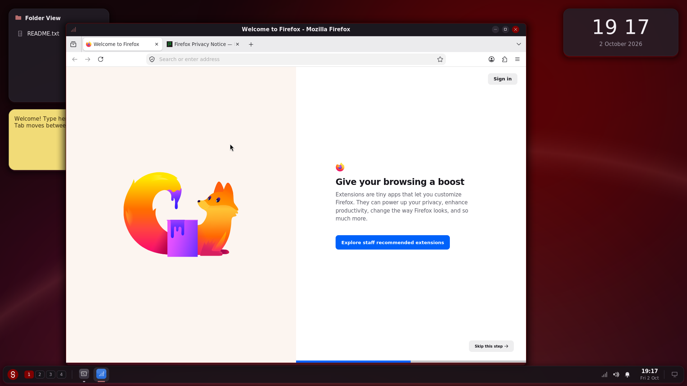

# Ai-Slop-that-Claude-Makes


So contained in these subfolders is anything that i've slaved claude into making.
Unfortunately for you I will not maintain anything unless asked so ALL projects will die eventually. 
If you want to modify them just make the request and ill have a look <3


## Cadence Media Player


This is cadence. It's my media player. 
This is currently the maintained project and will be managed the most! 
Play your songs and stuff

It reads your specified folder and displays them


## Rust Building (Minecraft mod)

A **Fabric** mod for **Minecraft 26.3** that brings building from the game Rust: a building plan
that places foundations, walls, doorways, windows, wall frames, floors and stairs on a grid, a hammer
to upgrade them twig → wood → stone → sheet metal → armored, a tool cupboard for building privilege
and upkeep (unpaid bases decay), code-locked doors and garage doors, and raiding with TNT.

Everything is in [`rust-building-mod/`](rust-building-mod/), including the ready-to-use
`rust-building-1.1.0.jar` and a guide to playing and building it.


## SkarletOS (x86-64 hobby OS)


A small UNIX-like operating system written in C for 64-bit PCs. It boots on its
own (no Linux or Windows underneath) and draws a modern desktop inspired by KDE
Plasma at 1918 × 1075, with a maroon accent colour:

* a floating panel, rounded translucent windows and popups, widgets, activities,
  notifications, a login screen, and dark and light themes;
* apps: Skarlet Terminal (a UNIX-style shell), Files, Write, Settings and Monitor,
  plus Skarlet Launcher (Alt+F1) and Skarlet Runner (Alt+F2);
* its own drivers for VMware's graphics adapter, the keyboard and the clock, and
  an in-memory file system.

**Download:** `skarletos.iso` from the [SkarletOS 0.1 release](https://github.com/newmangarry323-sketch/Ai-Slop-that-Claude-Makes/releases/tag/skarletos-v0.1), or
[`skarletos/release/skarletos.iso`](skarletos/release/skarletos.iso) in this repo.
Boot it in a VMware VM set to "Other 64-bit" (BIOS or UEFI; leave Secure Boot off).
The [SkarletOS README](skarletos/README.md#run-it-in-vmware) has the steps.


Everything is in [`skarletos/`](skarletos/), with screenshots, a guide to how it
works, and exercises.

### SkarletOS, Debian edition (installs Linux software)

The same desktop on top of **Debian 13** with a real Linux kernel, so you can
install and run Linux programs, terminal and graphical, with `apt`:

```sh
sudo apt update
sudo apt install firefox-esr     # or gimp, vlc, libreoffice...
sudo apt remove firefox-esr
```

Installed programs appear in the launcher and run in SkarletOS window frames.
It is a live ISO you can install to disk with `sudo skarlet-install`.

**Download:** `skarletos-linux.iso` from the
[Debian edition release](https://github.com/newmangarry323-sketch/Ai-Slop-that-Claude-Makes/releases/tag/skarletos-linux-v1.0).
In VMware choose "Debian 13.x 64-bit", 2 GB of memory; the live password is
`skarlet`. Details in the
[SkarletOS README](skarletos/README.md#debian-edition-install-linux-software).




## MIG Welder (Roblox)

A welding tool for Roblox that only works on metal. Hold the trigger on a metal part
and it lays a bead of overlapping ripples that glow white-hot and cool through orange
and red to grey. Run the bead along the seam between two metal parts and they weld
together. Wood, plastic and other non-metals won't strike an arc.

* travel speed and distance change the bead: too fast is thin and weak, too slow
  piles up, too far away spatters
* rusty metal and foil weld badly, and thin sheet can burn through
* a tack weld joins parts; longer, cleaner welds are stronger, and weak ones snap
  under load or on impact
* an auto-darkening welding helmet (H lifts it), a HUD showing speed and quality, and
  a practice bench with a strength test

**Install:** in Roblox Studio, paste the three scripts from
[`roblox-welder/src/`](roblox-welder/src/) into ReplicatedStorage (ModuleScript
`WelderShared`), ServerScriptService (Script) and StarterPlayerScripts (LocalScript),
then press Play. Rojo users can `rojo serve` in the folder instead.

Everything is in [`roblox-welder/`](roblox-welder/), with a guide to how it works and
things to try changing. It has not been tested in Studio yet, so check the Output window
on the first run.


# IF YOU HAVE ISSUES WITH MY STUFF AND STUFF DONT WORK DM ME ON DISCORD @LXKAHFU I'LL FIX!
