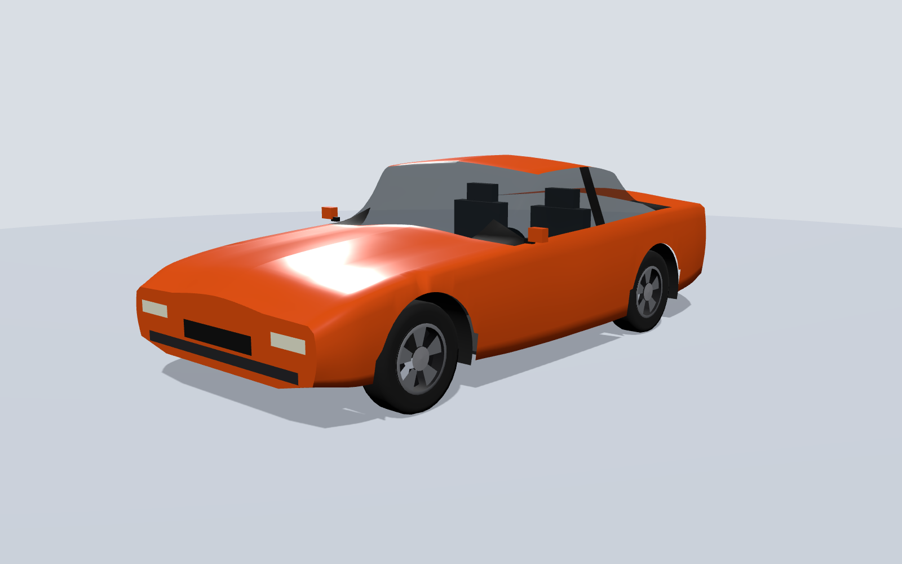
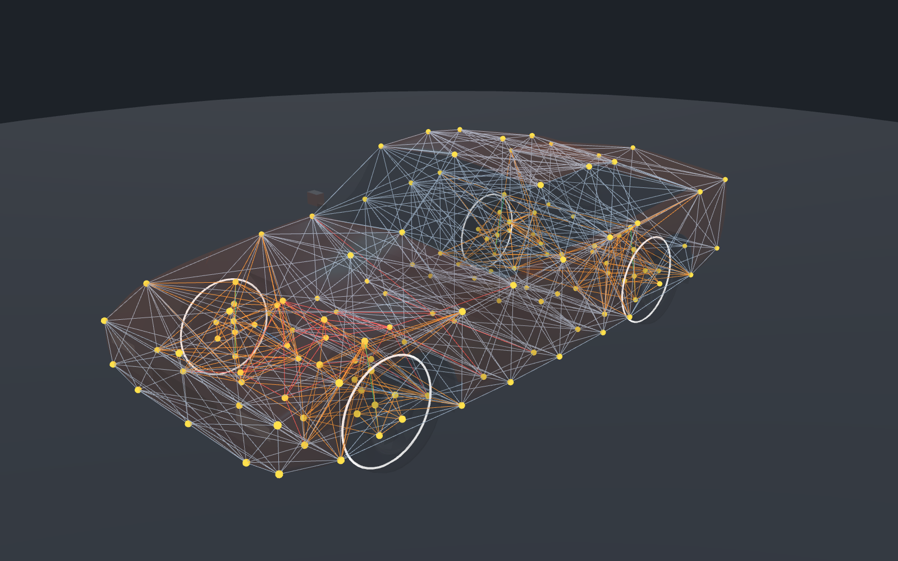

# Slopworks Kestrel (BeamNG.drive car mod)

A small rear-wheel-drive coupe for BeamNG.drive, built entirely from code:
its own body, physics skeleton, suspension, engine, gearbox, wheels and 3D
model, with no parts borrowed from the game's own cars. "Slopworks" is a
made-up company.



| | Base | Sport |
|---|---|---|
| Engine | 1.8 L four, 97 kW (131 hp) at 6000 rpm, 172 N m | sport cams: 125 kW (167 hp) at 7000 rpm, 192 N m |
| Gearbox | 5-speed manual | 5-speed manual |
| Differential | open, 4.10:1 | limited slip, 4.30:1 |
| Springs (front / rear) | 40 / 36 kN/m | 56 / 50 kN/m |
| Mass | about 1070 kg with 30 L of fuel, 53 % on the front axle | same |
| Size | 4.0 m long, 1.7 m wide, 1.25 m tall, 2.4 m wheelbase | same |

The power figures come straight from the torque curves in
[`tools/build_mod.py`](tools/build_mod.py). How fast the car actually goes
depends on the air drag in the game, so top speed is unknown until someone
drives it. The gearing alone would allow about 230 km/h.

> **Status: not tested in BeamNG.drive yet.** It was written without access to
> the game. The checks below are as close to the game as I could get, but
> expect the first drive to turn up problems. Open the game's console with
> the **`** key (the key left of 1 on a US keyboard) to see errors. Then
> tell me, or fix them yourself with the "How it works" section.

## Install

1. Download [`slop_kestrel.zip`](slop_kestrel.zip). Don't unzip it.
2. Put it in the `mods` folder of your BeamNG.drive user folder. On
   Windows the user folder is under `%LOCALAPPDATA%`, and the game's launcher
   can open it for you.
3. Start the game, open the vehicle selector and choose **Slopworks Kestrel**.
   There are two configurations, **Base** and **Sport**.

You can change the springs, dampers, tyre pressures, brakes, final drive and
fuel load in the game's tuning menu (Vehicle Config → Tuning).

## How it works

A BeamNG car has two halves. The **physics** half is a set of point masses
(**nodes**) joined by springs (**beams**). The game simulates these 2000
times a second, so a crash bends and breaks the real structure rather than
playing an animation. The **visual** half is a 3D mesh (a **flexbody**) that
is stretched to follow the nodes, so the bodywork dents wherever the
skeleton bends.



*Yellow: nodes. Grey: body beams. Orange: suspension. Red: engine and
gearbox mounts. Green: springs and dampers. Blue: steering. White rings: the
wheels the game builds by itself.*

Everything in [`mod/vehicles/slop_kestrel/`](mod/vehicles/slop_kestrel/) is
made by [`tools/build_mod.py`](tools/build_mod.py). The `.jbeam` files are
JSON with comments and are meant to be read: open them next to this list.

| File | What's in it | What to look for |
|---|---|---|
| `slop_kestrel.jbeam` | the main part (`"slotType": "main"`) | `slots`: which other parts plug in where |
| `kestrel_body.jbeam` | the body cage, its skin triangles, cameras | `nodes`, `beams` (with `beamDeform` and `beamStrength`), `triangles`, `refNodes` |
| `kestrel_suspension.jbeam` | double wishbones, springs, dampers, steering | `hydros` (steering), `beamPrecompression` on the springs, `|BOUNDED` bump stops |
| `kestrel_wheels.jbeam` | wheels, tyres, brakes | `pressureWheels`: the game makes the wheel from these numbers |
| `kestrel_engine.jbeam` | engine nodes, mounts, torque curve | `mainEngine.torque`, `powertrain` |
| `kestrel_drivetrain.jbeam` | clutch, gearbox, driveshaft, differential | `gearRatios`, `diffType`, `connectedWheel` |
| `kestrel_fueltank.jbeam` | fuel tank | `energyStorage` |
| `*.pc` and `info_*.json` | the two configurations | which part goes in each slot, and tuning values |
| `kestrel.dae` and `main.materials.json` | the 3D model and its colours | each mesh name matches a `flexbodies` entry |

Some ideas that took me a while to get right, and may help you:

* **Axes.** In BeamNG, +X is the car's left, +Y is **backwards** and +Z is
  up, all in metres. The front bumper is at y = -2.0.
* **Triangles hold shapes, squares don't.** A box made of beams folds flat
  unless every face has a diagonal. Every bay of the body cage is braced
  that way.
* **Flat webs are floppy.** A node held only by beams lying in one plane
  can bob in and out of that plane. The first version of this car had that
  problem: the centre nodes of the floor and bonnet wobbled. The drop test
  caught it, and diagonal braces fixed it (search for "drum skin" in
  `build_mod.py`).
* **Five links make one movement.** A wheel's upright is a rigid group of 6
  nodes, which can move in 6 ways. Two lower wishbone links, two upper ones
  and a tie rod remove 5 of them, leaving only up and down, and the spring
  controls that.
* **Springs are pre-loaded.** The nodes are drawn at ride height. Each
  spring's rest length is made longer than drawn (`beamPrecompression`) by
  exactly the amount the car's weight will squash it, so the car settles at
  the drawn height.
* **Steering is a beam that changes length.** A `hydro` lengthens or
  shortens with the steering input (`factor` sets how much). A positive input
  means steer right.
* **Slots make parts swappable.** Each part has a `slotType`. Parts that
  share one are alternatives in the parts menu. The Sport configuration is
  the Base one with four slots swapped.

## The checks

Without the game, the mod was checked three ways:

```sh
python3 tools/build_mod.py                       # rebuild the mod and the zip
git clone --depth 1 https://github.com/BeamNG/vscode-jbeam-editor /tmp/jbeam-editor
node tools/lint_jbeam.js /tmp/jbeam-editor       # 1. BeamNG's own JBeam parser
python3 tools/check_mod.py                       # 2. cross-checks and 3. drop test
```

1. **BeamNG's own parser.** BeamNG publishes the JBeam parser from its VS
   Code extension. Every file passes it. To make sure the linter isn't just
   passing everything, I fed it files with deliberate errors, and it caught them.
2. **Cross-checks** ([`tools/check_mod.py`](tools/check_mod.py)). It builds
   each configuration the way the game does, following the slots, then
   checks that:
   * every node a beam, wheel, camera or engine setting names exists
   * the powertrain connects the engine to both rear wheels
   * every mesh and material exists
   * every `$variable` is defined
   * the body faces point outwards
   * each node is heavy enough for its springs not to blow up at a 1/2000 s
     time step

   Planted mistakes (a misspelt node, a broken powertrain link, a wrong
   engine group) were all caught.
3. **A drop test.** A simplified simulation of the car settling onto flat
   ground for 3 seconds, with the tyres approximated as plain springs. The
   body ends up within 1 cm of the height it was drawn at. Nothing stretches
   more than 0.2 %, and it stops moving.

The pictures come from [`tools/render_preview.js`](tools/render_preview.js),
which renders the actual `.dae` file in a browser.

**What none of this can tell you:** how it drives, whether the crumple
zones are too soft or too hard, and whether the game accepts every setting.
The settings I'm least sure of:

* the engine sound uses the game's `"V6"` sample. I copied that name from
  another mod, so it is probably in the game, but I couldn't check.
* the material settings (`main.materials.json`), especially the
  see-through glass
* the meaning of `beamShortBound` and `beamLongBound` on the bump stops
* the drag coefficient on the body triangles (`"dragCoef": 6`), which is a
  guess

## Things to try

Each of these teaches you one part of the format. Change
`tools/build_mod.py`, rebuild, and run the checks.

1. **Make it softer or stiffer.** Change `TUNES` and see how
   `beamPrecompression` changes with it in `kestrel_suspension.jbeam`.
2. **Change the shape.** Edit `SECTIONS` in [`tools/shape.py`](tools/shape.py).
   Each row is one slice through the car. The physics nodes move with the
   mesh, because both are made from the same rows.
3. **Add anti-roll bars.** Real cars have them, and this one doesn't. Look
   up the `torsionbars` section in the BeamNG documentation.
4. **Make it four-wheel drive.** Add a front differential and shafts with
   `connectedWheel` set to `FL` and `FR`.
5. **Paintable body.** At the moment the colour is fixed in
   `main.materials.json`. Find out how the game's own cars let you pick a
   paint colour and copy that.
6. **Working lights.** The light meshes are there but don't glow. The
   `glowMap` section of the reference car below shows how.

## Credits and sources

The file layout and values were learned from these. No files were copied
from them.

* **BeamNG's Blender JBeam Editor** ([GitHub](https://github.com/BeamNG/Blender-JBeam-Editor), MIT licence).
  Its test files include BeamNG's "Square Donut" prop (CC0), which showed
  how a `.dae` mesh, `main.materials.json` and `flexbodies` fit together.
  They also include AgentY's
  [Toy Building Block Car](https://www.beamng.com/resources/toy-building-block-car.26315/),
  a complete working car mod I used as the main reference for engines,
  gearboxes, differentials, wheels and steering.
* **BeamNG's VS Code JBeam extension** ([GitHub](https://github.com/BeamNG/vscode-jbeam-editor), MIT licence).
  Its parser is used for the lint check, and its three.js copy for the
  pictures. Neither is included in this repo.
* **Qlourie Astral R** by ProgUn1corn ([GitHub](https://github.com/ProgUn1corn/Qlourie_Astral_R), CC0).
  This was the reference for the `info.json` fields and for realistic tyre
  values. The tyre beam values here are adapted from its 205/65 R15 tyre.
* The BeamNG documentation, at
  [documentation.beamng.com/modding/vehicle](https://documentation.beamng.com/modding/vehicle/),
  is the official reference for every JBeam section. Its site was blocked
  from where this was written, so I could only read search-result summaries
  of it.
