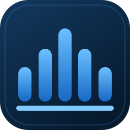
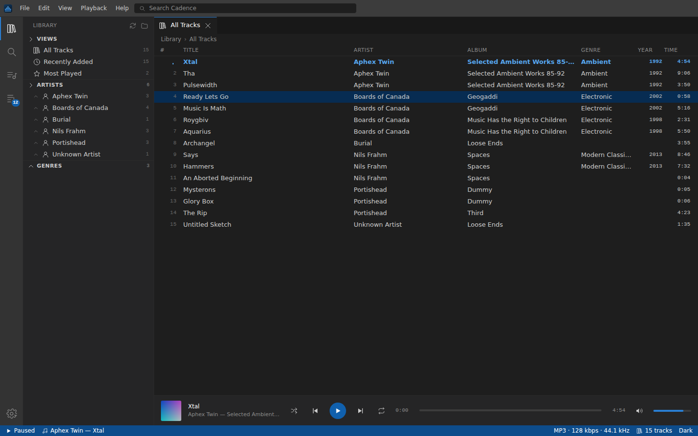

# Cadence

A music manager for a local library. Point it at one folder; it indexes that folder
and everything beneath it on every launch, and puts the result behind an interface
modelled on VS Code — activity bar, side bar, editor tabs, panel, command palette,
and a status bar in a dark blue accent.

<br clear="left">



## The whole program is one file

`Cadence.py` is the entire application — tag parser, library index, web server,
interface and icon generator. It imports nothing outside the Python standard
library, so there is no `pip install` step and no `requirements.txt`.

```
python Cadence.py                       # first run asks you to pick a folder
python Cadence.py --folder "D:\Music"   # designate it up front and scan now
```

It serves a local page on `127.0.0.1` and opens it in a chromeless browser window
(Chrome, Edge or Brave in `--app` mode), so it looks like a desktop app rather
than a tab. If none of those are installed it falls back to your default browser.

### Options

| Flag | What it does |
| --- | --- |
| `--folder PATH` | Designate the music folder and scan it (also accepted positionally) |
| `--port N` | Pin the port (default `8731`; falls back to a free one if taken) |
| `--rescan` | Re-read every file, ignoring size and timestamp |
| `--no-scan` | Skip the launch scan |
| `--no-browser` | Start the server only |
| `--write-icon [PATH]` | Write the app icon as a multi-resolution `.ico` (10 sizes, 16-256 px) |
| `--write-png [PATH]` / `--write-svg [PATH]` | Write the icon as PNG or SVG |

`Cadence.ico` is checked in, but `Cadence.py` draws it from the same geometry as
`Cadence.svg`, so `--write-icon` reproduces it byte for byte at any time. It stores
16, 20, 24, 32, 40, 48, 64, 96, 128 and 256 px — the sizes the Windows shell asks
for across its DPI scalings, so it never has to downsample a larger entry. 256 px
is the format's ceiling: an ICO directory entry holds the width in a single byte.
`--write-png` writes 1024 px for anywhere that is not Windows.

## Building `Cadence.exe`

PyInstaller bundles the interpreter, so the result runs on a machine with no
Python installed. On Windows:

```bat
pip install pyinstaller
python Cadence.py --write-icon Cadence.ico
pyinstaller --onefile --noconsole --name Cadence --icon Cadence.ico Cadence.py
```

`dist\Cadence.exe` is the finished program — a single file, nothing beside it.

You can also let GitHub build it: `.github/workflows/build-cadence-exe.yml` runs
those same commands on a Windows runner and uploads the exe as a build artifact.
Trigger it from the **Actions** tab (**Build Cadence.exe** → **Run workflow**),
then download `Cadence-windows` from the finished run. Pushing a tag that starts
with `cadence-v` also attaches the exe to a GitHub release.

## What it does

**Library.** Scans on every launch. A file is only re-parsed when its size or
modification time changed, so the second launch is effectively instant. Deleted
files drop out of the index. `F5` rescans on demand; **Full** re-reads everything.

**Formats.** Tags are read by hand-written parsers, so nothing needs installing:

| Container | Tags | Duration / bitrate | Cover art |
| --- | --- | --- | --- |
| MP3 | ID3v2.2 / 2.3 / 2.4, ID3v1 fallback | Xing / VBRI / CBR from frame headers | `APIC` |
| FLAC | Vorbis comments | `STREAMINFO` | `PICTURE` |
| Ogg Vorbis, Opus, Speex | Vorbis comments | Final page granule position | `METADATA_BLOCK_PICTURE` |
| MP4 / M4A / M4B | iTunes `ilst` atoms | `mdhd`, falling back to `mvhd` | `covr` |
| WAV | RIFF `LIST`/`INFO` + any ID3 chunk | `fmt ` byte rate | — |
| AIFF | `NAME` / `AUTH` | `COMM` | — |

Anything else with an audio extension is still indexed using its filename.
Files with no usable tags fall back to `Artist - Title` filename parsing and the
`Artist/Album/track` folder convention.

*Playback* is done by the browser's own audio engine. That covers MP3, WAV, FLAC,
M4A/AAC, Ogg and Opus on Chrome and Edge. Formats the engine cannot decode still
appear in the library with full metadata — they just will not play.

**Playing.** Queue with shuffle and repeat, seeking (the server answers HTTP range
requests, so scrubbing a large FLAC does not download it first), volume, play
counts, and cover art in the player and the details panel.

**Organising.** Playlists, export to `.m3u8`, multi-select with `Ctrl`/`Shift`,
sortable columns, search across title / artist / album / genre / filename, an
artist → album tree, and "Reveal in File Manager".

### Keyboard

| | |
| --- | --- |
| `Ctrl+P` / `Ctrl+Shift+P` | Quick open / command palette |
| `Ctrl+Shift+E` `F` `Y` `Q` | Library · Search · Playlists · Queue |
| `Ctrl+B` / `Ctrl+J` | Toggle side bar / panel |
| `Space` · `Ctrl+←` `→` | Play-pause · previous · next |
| `S` · `R` · `M` | Shuffle · repeat · mute |
| `Enter` · `Ctrl+A` · `Ctrl+C` · `Del` | Play selection · select all · copy path · remove |
| `F5` | Rescan |

## Your files

Cadence opens your audio files read-only. It never writes tags, renames, moves or
deletes anything in your music folder.

Everything it *does* write lives in one directory —
`%APPDATA%\Cadence` on Windows, `~/.config/cadence` on Linux,
`~/Library/Application Support/Cadence` on macOS — holding `library.db`
(a SQLite index with the cached tags, playlists and play counts) and a browser
profile for the app window. Deleting it discards the cache and playlists and
nothing else.

The server binds to `127.0.0.1` only, never to your network. Each run mints a
random token that requests must carry, and the `Host` header is checked, so
another page in your browser cannot read your library through the local port.

## Themes

Dark and light, plus six accent ramps (Deep Blue, Midnight, Azure, Steel, Indigo,
Teal) under **Settings**. The whole interface is tinted from one seven-stop ramp,
so an accent change recolours the status bar, selection, buttons and tab markers
together.

## License

MIT — see [LICENSE](../LICENSE).
