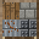

# Rust Building

Building from the survival game [Rust](https://rust.facepunch.com/) brought to Minecraft, as a
**Fabric** mod for **Minecraft 26.3**. Place whole foundations, walls and floors with a building plan,
upgrade them through Rust's five grades with a hammer, claim the area with a tool cupboard, lock your
doors with a code, and raid other bases with TNT.

<br clear="left">

## Download and install

1. Install [Fabric Loader](https://fabricmc.net/use/installer/) **0.19.5 or newer** for Minecraft **26.3**.
2. Put [Fabric API](https://modrinth.com/mod/fabric-api) **0.161.0+26.3** (or newer for 26.3) in your `mods` folder.
3. Put **`rust-building-1.0.0.jar`** in your `mods` folder. It is in this folder and on the
   [releases page](https://github.com/newmangarry323-sketch/Ai-Slop-that-Claude-Makes/releases) (tag `rust-building-v1.0.0`).

The mod adds blocks and items, so it must be installed on the **server and on every client**. It needs
Java 25, which the official launcher already ships with Minecraft 26.3.

## How to play

Everything is in the **Rust Building** creative tab, and all of it can be crafted (recipes below).

### The grid

Pieces snap to a fixed grid. Grid lines run every 4 blocks, so a foundation is a 5 x 5 slab whose
outer ring is shared with its neighbours, and walls stand on the shared lines. One foundation with four
walls gives a **3 x 3 room, 3 blocks high** - Rust's 3 m foundation at one block per metre. Each storey
is 4 blocks: the floor, then 3 blocks of wall. Corner pillars appear by themselves where walls meet.

### Building plan

Hold it and you see a see-through **blue** preview where the piece will go (**red** if it cannot go
there; the reason is shown under the crosshair). **Use** to place it. **Sneak + use** to choose a piece:

| Piece | Aim at | Size |
| --- | --- | --- |
| Foundation | the ground, or the side of a foundation to continue the grid | 3 x 3 + shared edge |
| Wall, Doorway, Window, Half Wall, Low Wall | the top of a foundation or floor, near the edge you want | 3 wide, 3 / 3 / 3 / 2 / 1 high |
| Floor | the top of a wall (goes on your side of it), the side of another floor, or the floor of the room it should cover | 3 x 3 |
| Stairs | the floor of a cell; they climb the way you face | fills one cell, reaches the next storey |

New pieces are **twig** and cost 1 stick per block (a foundation or wall is 9 sticks; stairs count
double). A foundation can stand up to 3 blocks above uneven ground; legs fill the gap.

### Hammer

- **Use** on a piece: upgrade it one grade.
- **Sneak + use**: menu - upgrade straight to any higher grade, repair, or **demolish** (refunds half of
  the current grade's cost).
- **Hit** (left click): repair it if damaged, otherwise show its health.

| Grade | Health (as in Rust) | Cost per block | Notes |
| --- | --- | --- | --- |
| Twig | 10 | 1 stick | breaks by hand and to any explosion, burns |
| Wood | 250 | 1 plank (any wood) | burns |
| Stone | 500 | 1 cobblestone (or blackstone / cobbled deepslate) | |
| Sheet Metal | 1000 | 2 iron nuggets | |
| Armored | 2000 | 1 iron ingot | |

Wood and better cannot be mined with tools or pushed by pistons, and withers and the dragon cannot
break them. A base comes apart through its owner's hammer, or through explosives.

### Tool cupboard

Placing one gives you **building privilege** in a cube 16 blocks out in every direction; use it to see
who is on its list and to **authorize** yourself, **deauthorize** yourself, or **clear the list** - the
same three actions as Rust. Inside the zone, players who are not on the list cannot place any block,
use the building plan or hammer, or pick up the cupboard or a Rust door. A cupboard cannot be placed
where its zone would overlap one that does not list you. As in Rust, anyone who can reach an unlocked
cupboard can add themselves, so **put a code lock on it**.

### Doors and code locks

- **Sheet Metal Door** (250 health) and **Armored Door** (800 health), Rust's values. They open by
  hand, cannot be mined by strangers, and ignore redstone while locked.
- **Code Lock**: use it on a Rust door or a tool cupboard and choose a 4-digit code. Anyone else is
  asked for the code; a right code is remembered, a wrong one gives a small shock (1 heart). The owner
  can **sneak + use** the door (or press *Code lock settings* on the cupboard) to change the code - which
  forgets everyone else - or take the lock off.

### Raiding

Explosions no longer delete the blocks they touch. They **damage the whole piece**, and it falls when
the damage reaches its grade's health. TNT right against a piece does 250, less further away, so it
takes **1 TNT for wood, 2 for stone, 4 for sheet metal and 8 for armored** (each grade has double the
health of the one before, as in Rust). A creeper is too weak to hurt anything but twig; a charged
creeper is not. Doors take damage the same way: 1 TNT for a sheet metal door, 4 for armored.

When a piece falls, whatever rested on it falls too: walls on a destroyed foundation edge, stairs on a
destroyed floor, floors that lost their last wall.

### Recipes

| Item | Recipe |
| --- | --- |
| Building Plan | 2 paper + 1 stick (shapeless) |
| Hammer | `P S P` / ` S ` / ` S ` - planks and sticks |
| Tool Cupboard | 8 logs around a chest |
| Code Lock | `N R N` / `N I N` - iron nuggets, redstone, an iron ingot |
| Sheet Metal Door | iron door + 2 iron ingots (shapeless) |
| Armored Door | sheet metal door + 2 iron blocks (shapeless) |

## What is different from Rust

Being honest about the simplifications:

- Square pieces only: no triangle foundations or floors, no roofs (a floor makes a flat roof), no
  rotation, no garage or double doors, no key locks.
- No *soft side*: walls take the same damage from both sides.
- No upkeep or decay: bases do not rot when the cupboard runs out of resources.
- Stability is supported / unsupported rather than Rust's percentage.
- The privilege zone is a fixed cube around the cupboard; Rust measures it from the building.
- Materials are Minecraft stand-ins (sticks, planks, cobblestone, iron) and their amounts are this mod's
  choice; the health values are Rust's.

## Build it yourself

You need a **JDK 25** (for example [Eclipse Temurin](https://adoptium.net/)). Gradle downloads itself.

```
cd rust-building-mod
./gradlew build                # compiles, runs the server game tests, writes build/libs/rust-building-1.0.0.jar
./gradlew runClient            # starts Minecraft with the mod, to try it
./gradlew runClientGameTest    # the client test: builds a demo base and takes screenshots
```

On Windows use `gradlew.bat`. GitHub Actions does the same on every push that touches this folder
(`.github/workflows/build-rust-building-mod.yml`).

### Where things are

| Path | What it does |
| --- | --- |
| `building/Grid.java`, `Edge.java` | the 4-block grid, cells and wall slots |
| `building/PiecePlanner.java` | turns "aiming here with this piece" into blocks to place, and checks the rules |
| `building/BuildingOps.java` | places, upgrades and destroys pieces; keeps shared edges and pillars right; collapses |
| `building/PieceLocator.java`, `PieceRef.java` | finds which piece a block belongs to |
| `raid/RaidDamage.java`, `PieceDamage.java` | explosion damage and where it is saved |
| `privilege/BuildingPrivilege.java` | tool cupboard zones |
| `lock/CodeLock.java` | the code lock |
| `client/PlacementPreview.java`, `BuildingHud.java` | the blue/red preview and the text under the crosshair |
| `client/screen/` | the menus |
| `src/gametest/` | automated server tests and the screenshot test |
| `tools/make_textures.py`, `make_assets.py` | redraw the textures and regenerate the JSON files |

Good places to learn Fabric modding: the [Fabric documentation](https://docs.fabricmc.net/develop/)
(its reference mod shows every API used here) and the
[Fabric example mod](https://github.com/FabricMC/fabric-example-mod) this project's build files follow.

## Sources

Rust facts used for this mod:

- Grade health (twig 10, wood 250, stone 500, sheet metal 1000, armored 2000) and upgrade materials:
  [Rustafied - Building: what you need to know](https://www.rustafied.com/building-in-rust),
  [Corrosion Hour - How to build in Rust](https://www.corrosionhour.com/how-to-build-in-rust/).
- Tool cupboard authorise / clear-list / lock behaviour:
  [Rust Wiki (archive) - Tool cupboard](https://rust-archive.fandom.com/wiki/Tool_cupboard).
- Door health (sheet metal 250, armored 800):
  [Rust Wiki - Sheet Metal Door](https://rust.fandom.com/wiki/Sheet_Metal_Door),
  [Rust Wiki - Armored Door](https://rust.fandom.com/wiki/Armored_Door).

Minecraft and Fabric versions: [Fabric for Minecraft 26.3](https://fabricmc.net/2026/09/15/263.html) and
the [Fabric example mod](https://github.com/FabricMC/fabric-example-mod).

Rust is a game by Facepunch Studios. This is an unofficial fan mod, not affiliated with Facepunch or
Mojang.
