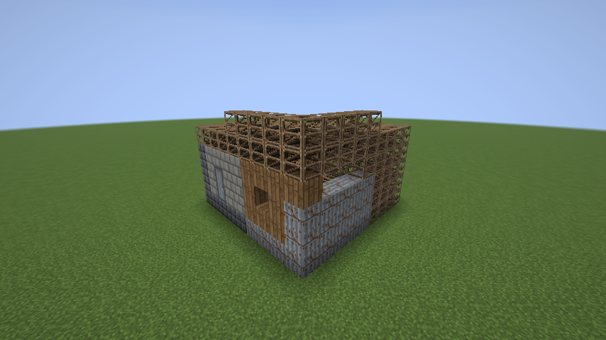
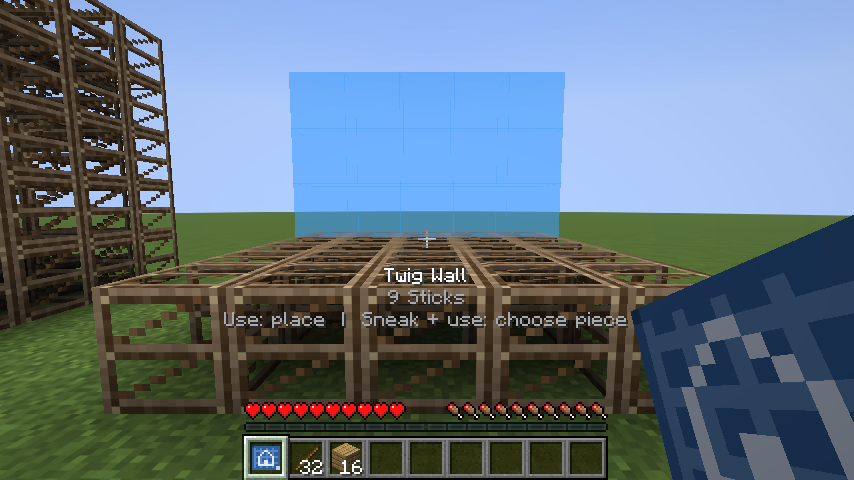
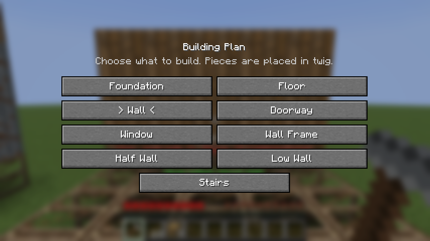
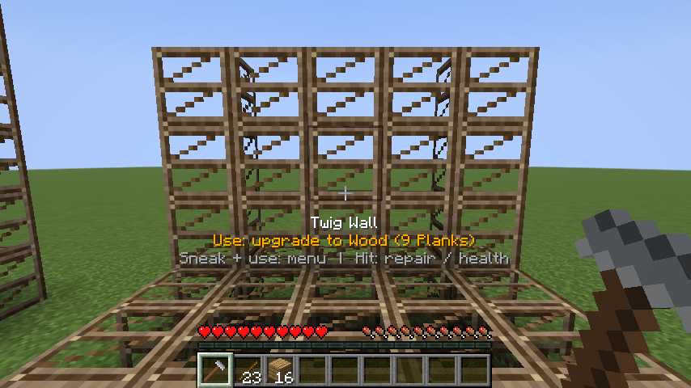
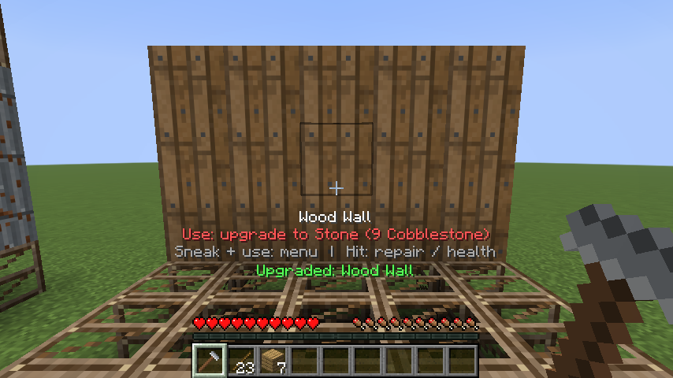
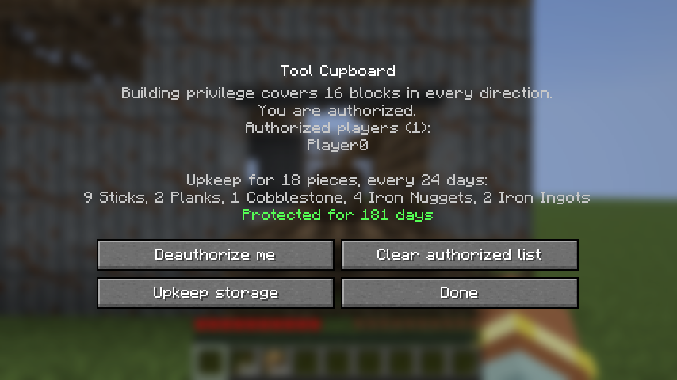
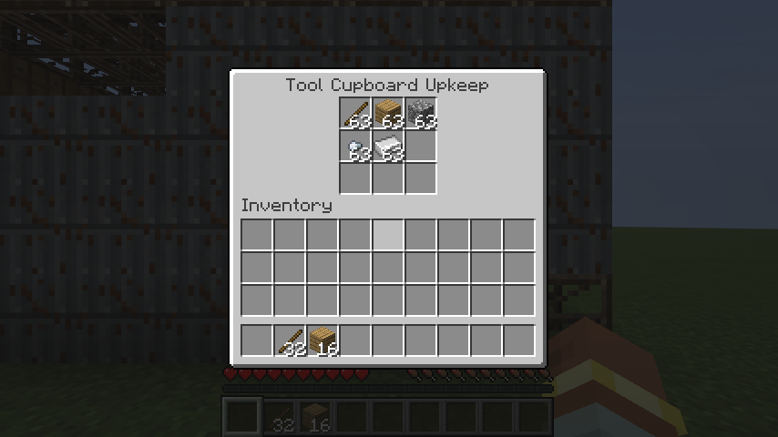
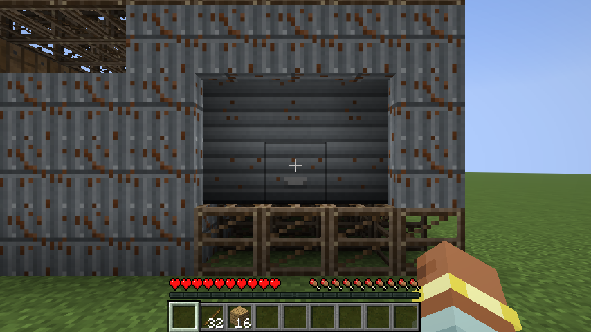
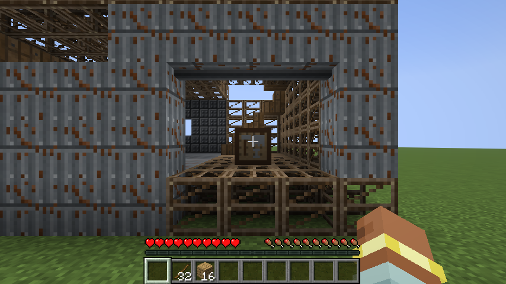
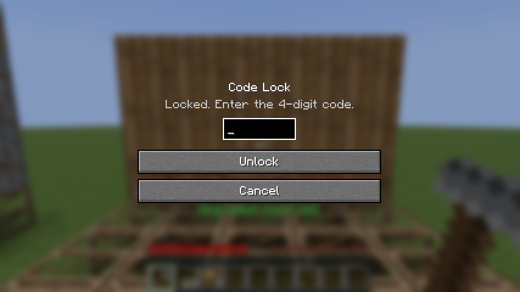

# Rust Building

Building from the survival game [Rust](https://rust.facepunch.com/) brought to Minecraft, as a
**Fabric** mod for **Minecraft 26.3**. Place whole foundations, walls and floors with a building plan,
upgrade them through Rust's five grades with a hammer, claim the area with a tool cupboard and keep
it stocked so your base does not decay, lock your doors and garage doors with a code, and raid other
bases with TNT.

<br clear="left">



*Screenshots are taken automatically by the client game test (`src/gametest`) in a real Minecraft 26.3
client on every release build.*

## Download and install

1. Install [Fabric Loader](https://fabricmc.net/use/installer/) **0.19.5 or newer** for Minecraft **26.3**.
2. Put [Fabric API](https://modrinth.com/mod/fabric-api) **0.161.0+26.3** (or newer for 26.3) in your `mods` folder.
3. Put **`rust-building-1.1.0.jar`** in your `mods` folder. It is in this folder and on the
   [releases page](https://github.com/newmangarry323-sketch/Ai-Slop-that-Claude-Makes/releases) (tag `rust-building-v1.1.0`).

The mod adds blocks and items, so it must be installed on the **server and on every client**. It needs
Java 25, the same as Minecraft 26.3 itself: the official launcher provides it, and a dedicated server
needs Java 25 installed.

**Updating from 1.0.0:** bases now decay unless a stocked tool cupboard covers them (see
[Upkeep and decay](#upkeep-and-decay)), so put materials in your cupboards.

## How to play

Everything is in the **Rust Building** creative tab, and all of it can be crafted (recipes below).

### The grid

Pieces snap to a fixed grid. Grid lines run every 4 blocks, so a foundation is a 5 x 5 slab whose
outer ring is shared with its neighbours, and walls stand on the shared lines. One foundation with four
walls gives a **3 x 3 room, 3 blocks high** - Rust's 3 m foundation at one block per metre. Each storey
is 4 blocks: the floor, then 3 blocks of wall. Corner pillars appear by themselves where walls meet.

### Building plan

Hold it and you see a see-through **blue** preview where the piece will go (**red** if it cannot go
there; the reason is shown under the crosshair). **Use** to place it. **Sneak + use** to choose a piece:



| Piece | Aim at | Size |
| --- | --- | --- |
| Foundation | the ground, or the side of a foundation to continue the grid | 3 x 3 + shared edge |
| Wall, Doorway, Window, Half Wall, Low Wall | the top of a foundation or floor, near the edge you want | 3 wide, 3 / 3 / 3 / 2 / 1 high |
| Wall Frame | the same | a beam on two posts around a 3 x 2 opening, for a garage door |
| Floor | the top of a wall (goes on your side of it), the side of another floor, or the floor of the room it should cover | 3 x 3 |
| Stairs | the floor of a cell; they climb the way you face | fills one cell, reaches the next storey |



New pieces are **twig** and cost 1 stick per block (a foundation or wall is 9 sticks, a wall frame 3;
stairs count double). A foundation can stand up to 3 blocks above uneven ground; legs fill the gap.

### Hammer

- **Use** on a piece: upgrade it one grade.
- **Sneak + use**: menu - upgrade straight to any higher grade, repair, or **demolish** (refunds half of
  the current grade's cost, and gives back any door in the wall).
- **Hit** (left click): repair it if damaged, otherwise show its health - and whether it is decaying.




| Grade | Health (as in Rust) | Cost per block | Decays in (no upkeep) | Notes |
| --- | --- | --- | --- | --- |
| Twig | 10 | 1 stick | 1 day | breaks by hand and to any explosion, burns |
| Wood | 250 | 1 plank (any wood) | 3 days | burns |
| Stone | 500 | 1 cobblestone (or blackstone / cobbled deepslate) | 5 days | |
| Sheet Metal | 1000 | 2 iron nuggets | 8 days | |
| Armored | 2000 | 1 iron ingot | 12 days | |

Wood and better cannot be mined with tools or pushed by pistons, and withers and the dragon cannot
break them. A base comes apart through its owner's hammer, through explosives, or through decay.

### Tool cupboard

Placing one gives you **building privilege** in a cube 16 blocks out in every direction; use it to see
who is on its list and to **authorize** yourself, **deauthorize** yourself, or **clear the list** - the
same three actions as Rust. Inside the zone, players who are not on the list cannot place blocks
(except TNT, so raiding stays possible), build, upgrade, repair or demolish pieces, or pick up the
cupboard or a door. A cupboard cannot be placed where its zone would overlap one that does not list
you. As in Rust, anyone who can reach an unlocked cupboard can add themselves or take its upkeep
materials, so **put a code lock on it**.

The cupboard's screen also shows its **upkeep**: how many pieces it covers, what they cost every 24
days, and how long the materials in its **upkeep storage** (nine slots, under the *Upkeep storage*
button) will last.




### Upkeep and decay

As in Rust, a base has to be paid for to last:

- **Upkeep.** A tool cupboard pays, from its storage, a share of what each piece in its zone cost to
  build, in that piece's own material: sticks for twig, planks for wood, cobblestone for stone, iron
  nuggets for sheet metal and iron ingots for armored. The share is Rust's: **10%** for each of the
  first 15 pieces, **15%** for the next 50, **20%** for the next 125 and **33.3%** beyond that,
  averaged over the whole base, every upkeep period.
- **Decay.** A piece that no tool cupboard pays for loses health steadily, and falls when it reaches
  zero - from full health in the times in the table above. If a cupboard runs out of one material,
  only the pieces of that grade decay. A cupboard's own block and doors do not decay.

**Time.** Rust charges upkeep every 24 hours, and its grades decay in 1, 3, 5, 8 and 12 hours. Here
**one hour of Rust is one Minecraft day** (20 minutes of play), so upkeep is charged every 24 Minecraft
days (8 hours of play) and every ratio between upkeep and decay is the same as in Rust. Example: one
twig foundation costs 9 sticks; its upkeep is 10% of that, 0.9 sticks every 24 days, so one stick
keeps it for about 27 days. A small base in stone needs a stack of cobblestone every month or two.

Decay only runs where the world is loaded, like crops and furnaces - but a base nobody visited catches
up on the decay it missed as soon as someone comes back, and so does its cupboard's upkeep.

### Doors, garage doors and code locks

- **Sheet Metal Door** (250 health) and **Armored Door** (800 health), Rust's values, go in a doorway.
  They open by hand, cannot be mined by strangers, and ignore redstone while locked.
- **Garage Door** (600 health, Rust's value) goes in a **wall frame**: use it on the frame, or on the
  floor in its opening. It fills the 3 x 2 opening and **rolls up** a row at a time when used, and
  will not come down on someone standing in it. Breaking any part (as its owner) gives back the
  whole door.
- **Code Lock**: use it on a door, a garage door or a tool cupboard and choose a 4-digit code. Anyone
  else is asked for the code; a right code is remembered, a wrong one gives a small shock (1 heart).
  The owner can **sneak + use** the door (or press *Code lock settings* on the cupboard) to change the
  code - which forgets everyone else - or take the lock off.






### Raiding

Explosions no longer delete the blocks they touch. They **damage the whole piece**, and it falls when
the damage reaches its grade's health. TNT right against a piece does 250, less further away, so it
takes **1 TNT for wood, 2 for stone, 4 for sheet metal and 8 for armored** (each grade has double the
health of the one before, as in Rust). A creeper is too weak to hurt anything but twig; a charged
creeper is not. Doors take damage the same way: **1 TNT for a sheet metal door, 3 for a garage door,
4 for an armored door**.

When a piece falls, whatever rested on it falls too: walls on a destroyed foundation edge, stairs on a
destroyed floor, floors that lost their last wall, and any door in a fallen wall.

### Recipes

| Item | Recipe |
| --- | --- |
| Building Plan | 2 paper + 1 stick (shapeless) |
| Hammer | `P S P` / ` S ` / ` S ` - planks and sticks |
| Tool Cupboard | 8 logs around a chest |
| Code Lock | `N R N` / `N I N` - iron nuggets, redstone, an iron ingot |
| Sheet Metal Door | iron door + 2 iron ingots (shapeless) |
| Armored Door | sheet metal door + 2 iron blocks (shapeless) |
| Garage Door | 8 iron ingots around a piston |

## What is different from Rust

Being honest about the simplifications:

- Square pieces only: no triangle foundations or floors, no roofs (a floor makes a flat roof), no
  rotation, no double doors, no key locks.
- No *soft side*: walls take the same damage from both sides.
- Time runs differently: one Rust hour is one Minecraft day (see [Upkeep and decay](#upkeep-and-decay)),
  and decay and upkeep only advance while the game is running.
- The cupboard's storage takes any item (only building materials are used for upkeep), there is no
  24-hour grace when a stocked cupboard is destroyed, and doors do not decay or cost upkeep.
- Stability is supported / unsupported rather than Rust's percentage.
- The privilege zone is a fixed cube around the cupboard; Rust measures it from the building.
- Materials are Minecraft stand-ins (sticks, planks, cobblestone, iron) and their amounts are this mod's
  choice; the health values, upkeep brackets and decay times are Rust's.

## Build it yourself

You need a **JDK 25** (for example [Eclipse Temurin](https://adoptium.net/)). Gradle downloads itself.

```
cd rust-building-mod
./gradlew build                # compiles, runs the server game tests, writes build/libs/rust-building-1.1.0.jar
./gradlew runClient            # starts Minecraft with the mod, to try it
./gradlew runClientGameTest    # the client test: builds a demo base and takes screenshots
```

On Windows use `gradlew.bat`. GitHub Actions does the same on every push that touches this folder
(`.github/workflows/build-rust-building-mod.yml`).

### Where things are

| Path | What it does |
| --- | --- |
| `building/Grid.java`, `Edge.java` | the 4-block grid, cells and wall slots |
| `building/PieceType.java` | the pieces, with each wall's shape as a small text pattern |
| `building/PiecePlanner.java` | turns "aiming here with this piece" into blocks to place, and checks the rules |
| `building/BuildingOps.java` | places, upgrades and destroys pieces; keeps shared edges and pillars right; collapses |
| `building/PieceLocator.java`, `PieceRef.java` | finds which piece a block belongs to |
| `block/GarageDoorBlock.java` | the garage door: its six blocks, rolling up, lock and raid damage |
| `raid/RaidDamage.java`, `PieceDamage.java` | explosion damage and where it is saved |
| `upkeep/Upkeep.java`, `UpkeepAccount.java` | Rust's upkeep brackets, counting a cupboard's pieces, paying from its storage |
| `upkeep/Decay.java`, `DecayClocks.java` | decay of unprotected pieces, and how far it has been counted |
| `privilege/BuildingPrivilege.java` | tool cupboard zones |
| `lock/CodeLock.java` | the code lock |
| `client/PlacementPreview.java`, `BuildingHud.java` | the blue/red preview and the text under the crosshair |
| `client/screen/` | the menus |
| `src/gametest/` | automated server tests and the screenshot test |
| `tools/make_textures.py`, `make_assets.py` | redraw the textures and regenerate the JSON files |

Good places to learn Fabric modding: the [Fabric documentation](https://docs.fabricmc.net/develop/)
(its reference mod shows every API used here) and the
[Fabric example mod](https://github.com/FabricMC/fabric-example-mod) this project's build files follow.

## Sources

Rust facts used for this mod:

- Grade health (twig 10, wood 250, stone 500, sheet metal 1000, armored 2000) and upgrade materials:
  [Rustafied - Building: what you need to know](https://www.rustafied.com/building-in-rust),
  [Corrosion Hour - How to build in Rust](https://www.corrosionhour.com/how-to-build-in-rust/).
- Tool cupboard authorise / clear-list / lock behaviour:
  [Rust Wiki (archive) - Tool cupboard](https://rust-archive.fandom.com/wiki/Tool_cupboard).
- Door health (sheet metal 250, armored 800):
  [Rust Wiki - Sheet Metal Door](https://rust.fandom.com/wiki/Sheet_Metal_Door),
  [Rust Wiki - Armored Door](https://rust.fandom.com/wiki/Armored_Door).
- Garage door (600 health, fits a wall frame, takes a code lock):
  [RustHelp - Garage Door](https://rusthelp.com/items/garage-door),
  [RustClash wiki - Garage Door](https://wiki.rustclash.com/item/garage-door).
- Upkeep (the server defaults: brackets of 15, 50 and 125 blocks at 10%, 15% and 20%, then 33.3%,
  averaged over the building, every 24 hours) and decay times (twig 1, wood 3, stone 5, sheet metal 8,
  armored 12 hours):
  [Corrosion Hour - Rust decay and upkeep variables](https://www.corrosionhour.com/rust-decay-upkeep-variable/),
  [Rust Wiki - Decay](https://rust.fandom.com/wiki/Decay).

Minecraft and Fabric versions: [Fabric for Minecraft 26.3](https://fabricmc.net/2026/09/15/263.html) and
the [Fabric example mod](https://github.com/FabricMC/fabric-example-mod).

Rust is a game by Facepunch Studios. This is an unofficial fan mod, not affiliated with Facepunch or
Mojang.
