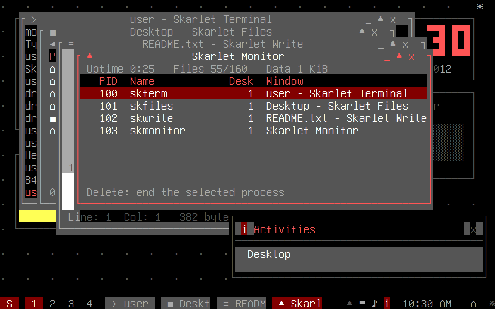

# SkarletOS

A small UNIX-like operating system for **x86-64 PCs**, written in C, whose desktop
follows the design ideas of the **2012 KDE Plasma 4 workspace** (Plasma Workspaces
4.8 and 4.9). It boots on its own, with no Linux underneath, and draws everything
in the 80×25 VGA text mode. The interface is modelled on the **KDE Plasma 4.8**
desktop of early 2012, and its accent colour is **maroon** by default.


| | | |
|---|---|---|
|  Skarlet Launcher (Alt+F1) |  Skarlet Runner (Alt+F2) |  Skarlet Files |
|  Add Widgets strip |  Activities strip |  Skarlet Dark theme |

These are real screenshots of the kernel running in an x86-64 emulator. The
**[demo and examples guide](docs/EXAMPLES.md)** has the full 21-screen tour (also
as an [animated GIF](docs/screenshots/tour.gif)), shell transcripts, Skarlet Runner
examples, and two worked examples of extending the system.

It is a learning project: about 7,000 lines you can read in an afternoon or two.
It is **not** a real UNIX. There are no processes, no memory protection and no disk.
See [What it does not do](#what-it-does-not-do).

## What you get

* **A 64-bit kernel.** The boot loader starts the CPU in 32-bit mode. `boot/boot.S`
  checks the CPU supports x86-64, builds page tables, switches to *long mode*, and
  then calls C.
* **A UNIX-style shell** inside a Skarlet Terminal window, with `ls -l`, `cd`, `cat`,
  `echo`, `> file` / `>> file` redirection, `mkdir`, `rm -r`, `cp`, `mv`, `wc`, `ps`,
  `kill`, `date`, `uname -a`, `history`, `calc` and more (`help` lists them all).
* **An in-memory file system** with a normal UNIX tree (`/bin`, `/etc`, `/home/user`,
  `/tmp`…), permission bits (shown, not enforced) and errno-style errors. Every
  shell command also shows up as a file in `/bin`.
* **The Plasma 4 desktop model** (next sections): plasmoids, containments, a panel,
  activities, a launcher, a runner, the desktop toolbox ("cashew"), themes and
  notifications, laid out like KDE Plasma 4.8.
* **Apps**, each modelled on a KDE 4 application:

  | SkarletOS app | Shell command | Modelled on (KDE 4) |
  |---|---|---|
  | Skarlet Terminal | `skterm` | Konsole |
  | Skarlet Files | `skfiles [dir]` | Dolphin |
  | Skarlet Write | `skwrite [file]` | KWrite |
  | Skarlet Settings | `sksettings` | System Settings |
  | Skarlet Monitor | `skmonitor` | System Activity (KSysGuard) |
  | Skarlet Launcher | Alt+F1 | Kickoff |
  | Skarlet Runner | Alt+F2 | KRunner |
  | `skdialog` | `skdialog --msgbox TEXT` | kdialog |

  They are tiny re-imaginings, not ports of the real programs.
* **Widgets:** Folder View, Notes, a big Digital Clock, System Monitor, and the
  Fifteen Puzzle.
* **Themes and accent colour:** Skarlet Light (default) and Skarlet Dark, each
  combined with an accent colour: **Maroon (default)**, Blue, Teal, Green or Purple.
  Change them in Skarlet Settings.

## The 2012 Plasma design ideas, and where they live in the code

| Plasma 4 idea | What it means | In SkarletOS |
|---|---|---|
| **Plasmoid** | Everything on the desktop and the panel is a widget, a "plasmoid" | `src/plasmoids.c`: each widget is a table of `init/draw/key` functions |
| **Containment** | A widget that holds other widgets. The desktop and the panel are both containments | Desktop: `draw_widgets()`. Panel: the `panel_applets[]` table in `src/workspace.c` |
| **Activities** | Separate desktops, each with its own set of widgets, for different tasks | `struct activity` in `src/desktop.h`. "Desktop" and "Play" ship by default; windows belong to an activity too |
| **Desktop toolbox ("cashew")** | The Plasma logo in the corner that holds Add Widgets, Activities and Lock Widgets | The `☼` top right, opened with Alt+F12 |
| **Kickoff** | Launcher with Favorites / Applications / Computer / Recently Used / Leave tabs and a search box | Skarlet Launcher: `draw_launcher()` and `launcher_build()` |
| **KRunner** | One text box that launches apps, opens places, does maths and runs commands | Skarlet Runner: `runner_build()`, with calculator, application, places and command-line "runners" |
| **Desktop themes** | The look (KDE shipped "Air" and "Oxygen") is separate from the widgets | `theme_apply()` in `src/gfx.c` builds Skarlet Light or Dark around the accent colour |
| **Panel** | A containment along a screen edge holding applets: launcher, pager, task manager, system tray, clock, "peek at desktop", panel toolbox [16] | Bottom of the screen, applets left to right (`panel_applets[]`) |
| **Widget Explorer** | Opened with "Add Widgets" from the desktop toolbox [16] | The Add Widgets strip: `draw_strip()` |

## The Plasma 4.8 look

The screen is 80×25 characters, so this is an impression of Plasma 4.8, not a
copy. Here is what was imitated and where:

| Plasma 4.8 | SkarletOS | Code |
|---|---|---|
| **Kickoff**: search field at the top; Favorites, Applications (by category), Computer, Recently Used (applications *and* documents) and Leave tabs [15] | User and search field in the header, two-line entries (name, then description), icon tabs along the bottom, a category level with a "◄ All Applications" breadcrumb, Recently Used split into Applications and Documents, Leave split into Session and System | `launcher_build()`, `draw_launcher()` |
| **KRunner**: a bar that drops down from the top of the screen [2] | Hangs from the top edge with help/settings icons on the left and a close button on the right; results have icons | `draw_runner()` |
| **Oxygen window decoration**: the title bar has the window's own colour, and the active window is marked by a glow, blue by default [17] | Window-coloured title bars, the app's icon on the left, `_ ▲ x` on the right, and a maroon glow round the active window | `draw_frame()` in `src/wm.c` |
| **Default panel** [16] | A taller panel (a half-block rim above the applet row) with launcher, pager, task buttons with icons, system tray (hidden-icons arrow, device notifier, volume, notifications), clock, show desktop and the panel toolbox | `draw_panel()` |
| **Widgets** with their title inside, and an applet handle beside a focused, unlocked widget | Folder View, System Monitor and Fifteen Puzzle show a title under which a line runs; the handle shows `x` (Delete removes) and `↕` (Alt+arrows move) | `draw_widgets()`, `draw_applet_handle()` |
| **Add Widgets** and **Activities** as strips above the panel | Tiles with icons, a description of the selected one, search (widgets) or Delete (activities) | `draw_strip()` |
| **Notifications** above the system tray | Icon, title, close button, message; they move above an open strip | `draw_toast()` |

**From memory, not from a source:** the horizontal Add Widgets and Activities
strips, the applet handle, Kickoff's breadcrumb and its Session/System grouping on
the Leave tab, and the exact panel order. These are how I remember KDE 4.x. I
could not confirm them against KDE's documentation (kde.org was not reachable
from where this was built), so check them if exactness matters to you.

### How the maroon accent is made

The VGA text mode has 16 fixed colour numbers. Colour 4 is normally red
(#AA0000). At boot, `vga_init()` in `kernel/arch_x86_64.c` reprograms the VGA's
DAC, the chip that turns colour numbers into red/green/blue signals. It sets the
DAC entry used by colour 4 to the levels 32, 0, 0. The DAC has 6-bit levels
(0–63), so that gives #820000, the closest a VGA can get to HTML/CSS maroon
(#800000) [13]. The theme code calls this colour `MAROON`. The accent's lighter
partner, for prompts and highlights on dark backgrounds, is light red (#FF5555).
`make emutest` checks that the kernel writes these DAC values. The terminal
version and the screenshot renderer draw colour 4 as #820000 too.

## Building and running

You need `gcc`, GNU `ld` and `make` on Linux (on other systems, use an
`x86_64-elf` cross-compiler).

```sh
cd skarletos
make            # builds build/skarletos.bin (64 KB) and build/skarletos.elf
make run        # boots it in QEMU: qemu-system-x86_64 -kernel build/skarletos.bin
make iso        # bootable CD image via GRUB (needs grub-mkrescue and xorriso)
make host       # build/skarlet-tty: the same desktop inside a terminal (80x25 or bigger)
make shell      # build/skarlet-sh: just the shell and file system, to practise commands
make test       # 193 scripted UI/shell/file-system checks plus a 40,000-key fuzz run
make emutest    # boots the real kernel in the Unicorn CPU emulator (pip install unicorn)
make demo       # records the screenshot tour from the real kernel into build/demo
                # (needs unicorn, Chromium, ImageMagick and ffmpeg)
```

`skarletos.bin` is a Multiboot kernel. It uses the Multiboot "address fields" (flag
bit 16), so 32-bit loaders such as QEMU's `-kernel` and GRUB's `multiboot` command
can load it even though the code inside is 64-bit.

### Keys

| Key | Action | Same as KDE 4? |
|---|---|---|
| Alt+F2 | Skarlet Runner | Yes (for KRunner), documented by KDE UserBase [2] |
| Alt+F1 | Skarlet Launcher | My choice; **not verified** as a KDE default |
| Alt+F12 | Desktop toolbox: widgets, activities, lock | SkarletOS only (KDE used the mouse here) |
| Alt+Tab / Alt+F4 | Next window / close window | Common KDE bindings; not checked against a source |
| Alt+F7, then arrows | Move the window | Meant to match KWin; **not verified** |
| Ctrl+F1 … Ctrl+F4 | Switch virtual desktop | Meant to match KDE; **not verified** |
| Ctrl+F12 | Dashboard (widgets over windows) | Meant to match KDE 4; **not verified** |
| Ctrl+Esc | Skarlet Monitor | Meant to match KDE 4 (System Activity); **not verified** |
| Tab / Shift+Tab | On the desktop: focus the next/previous widget | SkarletOS |
| Alt+arrows | Move the focused widget (when widgets are unlocked) | SkarletOS |
| Delete | Remove the focused widget (when unlocked); in the Activities strip, remove the selected activity | SkarletOS |
| Backspace | In the launcher with an empty search: back out of an application category | SkarletOS |
| Shift+PgUp / PgDn | Skarlet Terminal scrollback | Konsole convention |
| Ctrl+S | Save in Skarlet Write | Standard |

"Not verified" means I wrote these from memory of KDE 4 and could not confirm
them against KDE's documentation. Check them yourself if it matters to you.

In `skarlet-tty`, terminals often swallow Alt/Ctrl+F-keys, so **Ctrl+A** then a
letter also works: `k` launcher, `r` runner, `w` toolbox, `t` next window, `x` close,
`m` move, `1`–`4` desktops, `d` dashboard, `s` Skarlet Monitor, `q` quit.

## How it fits together

```
boot/boot.S          32-bit entry -> page tables -> long mode -> kmain()
boot/linker.ld       memory layout (kernel at 1 MiB)
kernel/arch_x86_64.c the only hardware code: VGA text memory, PS/2 keyboard,
                     CMOS clock, reboot/power-off. Implements src/platform.h
src/platform.h       the small hardware boundary (keys, screen, time, power)
src/workspace.c      main loop, key routing, panel, launcher, runner, toolbox,
                     activities, notifications, login screen
src/wm.c             window manager: stacking, focus, frames, virtual desktops
src/apps.c           Skarlet Terminal, Files, Write, Settings and Monitor
src/plasmoids.c      desktop widgets
src/shell.c          command parsing, redirection, built-in commands
src/vfs.c            the in-memory file system and the starting files
src/gfx.c            back buffer drawing, themes and accent colours
src/lib.c            string functions, printf, calculator (no libc in a kernel)
host/                Linux implementations of platform.h: tests, terminal app, shell
tools/               emulator boot test, screenshot tour recorder and renderer
docs/                demo and examples guide, screenshots
```

Because only `kernel/arch_x86_64.c` touches hardware, the rest compiles unchanged
on Linux. That is how the tests run the real desktop code.

## How it was tested

* `make test` runs the desktop code on Linux under AddressSanitizer and UBSan. It
  makes 193 checks across the shell, file system, launcher (tabs, categories,
  search), runner, windows, the Add Widgets and Activities strips, widgets and the
  applet handle, themes, the maroon accent and shutdown. Then it sends 40,000
  random key presses. All pass.
* `make emutest` boots the actual `skarletos.bin` in the Unicorn CPU emulator,
  starting at the 32-bit entry point exactly as a Multiboot loader would. It
  confirms paging, PAE and long mode (EFER.LME/LMA) are active and that the CPU is
  in the 64-bit code segment, and that VGA colour 4 was reprogrammed to
  maroon. It then types on the emulated PS/2 keyboard to log in, use Skarlet
  Runner, run `uname -a` and `ls /` in Skarlet Terminal, and shut down through the
  QEMU power-off port. All pass.
* `make demo` drives the same emulated kernel through a 21-step tour and checks
  the expected text on every screen before saving it.
* **Not yet tested:** QEMU itself (it couldn't be installed where this was built),
  GRUB/ISO booting, and real hardware. Real hardware is the least likely to work:
  newer PCs may lack VGA text mode or PS/2 keyboard emulation, and power-off needs
  ACPI there.

## What it does not do

No processes or scheduler, no user/kernel separation, no interrupts (the keyboard
and clock are *polled*, which keeps one CPU core busy), no disk (files vanish on
reboot), no mouse, no networking, no graphics mode. Passwords are not checked.
Each of these is a good next project.

## Learning from it, and exercises

Read the files in this order: `boot/boot.S`, `kernel/arch_x86_64.c`, `src/vfs.c`,
`src/shell.c`, `src/plasmoids.c`, `src/workspace.c`. Then try, roughly from
easiest to hardest:

1. Add a shell command (say `rev` or `head`) in `src/shell.c`. Add it to both tables.
2. Write a new plasmoid (a calendar?) in `src/plasmoids.c` and add it to the Add Widgets list.
3. Add an accent colour to `g_accents[]` in `src/gfx.c`, or a third theme to `theme_apply()`.
4. Support pipes (`ls | wc`) in the shell.
5. Read the mouse from the PS/2 controller (OSDev "Mouse Input") and draw a pointer.
6. Replace polling with interrupts: build an IDT, remap the PIC, and use `hlt` to idle.

The OSDev wiki pages in the sources below explain the hardware side of each step.

## Sources

The KDE facts come from KDE's own announcements and wikis (plus one forum thread
for the Oxygen glow colour). The hardware facts come from the OSDev wiki and the
Multiboot specification. None of these are state-run media.

1. KDE, "KDE Plasma Workspaces 4.8 Gain Adaptive Power Management" (4.8 released
   25 January 2012): https://kde.org/announcements/4/4.8.0/plasma/
2. KDE UserBase, "Plasma/Krunner" (KRunner, Alt+F2, runners):
   https://userbase.kde.org/Plasma/Krunner
3. KDE, "Plasma Workspaces 4.9" (4.9.0 released 1 August 2012):
   https://kde.org/announcements/4/4.9.0/plasma/
4. KDE TechBase, "Projects/Plasma/Vocabulary" (plasmoid, containment, "cashew"
   desktop toolbox): https://techbase.kde.org/Projects/Plasma/Vocabulary
5. KDE TechBase, "Projects/Plasma/Plasmoids": https://techbase.kde.org/Projects/Plasma/Plasmoids
6. OSDev Wiki, "Bare Bones" (Multiboot kernel, VGA text buffer at 0xB8000):
   https://wiki.osdev.org/Bare_Bones
7. OSDev Wiki, "8042 PS/2 Controller" (ports 0x60/0x64) and "PS/2 Keyboard":
   https://wiki.osdev.org/%228042%22_PS/2_Controller and https://wiki.osdev.org/PS/2_Keyboard
8. OSDev Wiki, "CMOS" and "RTC" (ports 0x70/0x71): https://wiki.osdev.org/CMOS and
   https://wiki.osdev.org/RTC
9. OSDev Wiki, "Shutdown" (QEMU 0x604, Bochs/older QEMU 0xB004) and "Reboot"
   (8042 reset, 0xFE): https://wiki.osdev.org/Shutdown and https://wiki.osdev.org/Reboot
10. OSDev Wiki, "Setting Up Long Mode": https://wiki.osdev.org/Setting_Up_Long_Mode
    (cited from general knowledge; not opened while building this)
11. GNU, "Multiboot Specification version 0.6.96" (header address fields, flag bit 16):
    https://www.gnu.org/software/grub/manual/multiboot/multiboot.html (cited from
    general knowledge; not opened while building this)
12. Unicorn CPU emulator (used by `make emutest`): https://github.com/unicorn-engine/unicorn
13. W3C, "CSS Color Module Level 3", basic colour keywords (maroon = #800000):
    https://www.w3.org/TR/css-color-3/#html4 (cited from general knowledge; not
    opened while building this)
14. OSDev Wiki, "VGA Hardware" (DAC ports 0x3C8/0x3C9, 6-bit colour levels):
    https://wiki.osdev.org/VGA_Hardware (cited from general knowledge; not opened
    while building this)
15. KDE UserBase, "Plasma/Kickoff" (search field at the top; Favorites,
    Applications, Computer, Recently Used and Leave tabs):
    https://userbase.kde.org/Plasma/Kickoff/en
16. KDE UserBase, "Plasma" (the default bottom panel's applets, including "peek at
    desktop"; Add Widgets opens the Widget Explorer): https://userbase.kde.org/Plasma
17. openSUSE Forums, "KDE - Default Blue Glow/Shadow on Active Window, How to
    Change?" (Oxygen's active-window glow):
    https://forums.opensuse.org/t/kde-default-blue-glow-shadow-on-active-window-how-to-change/48356
