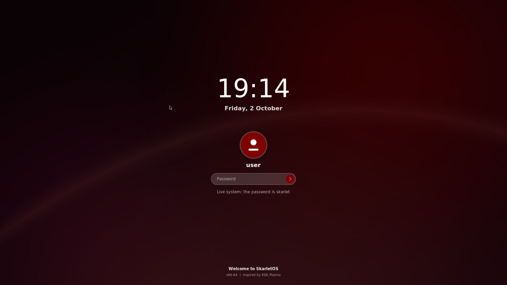
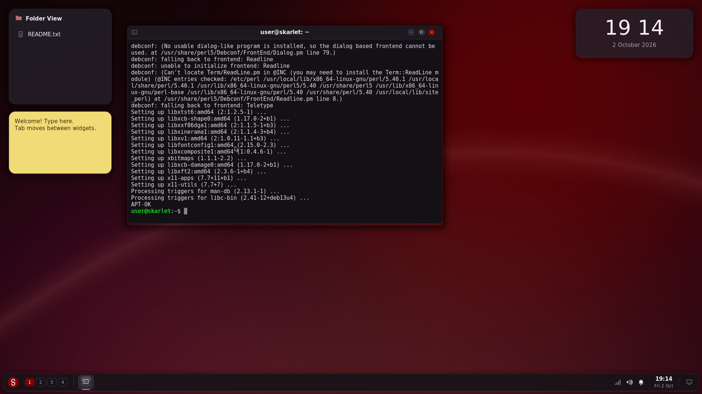
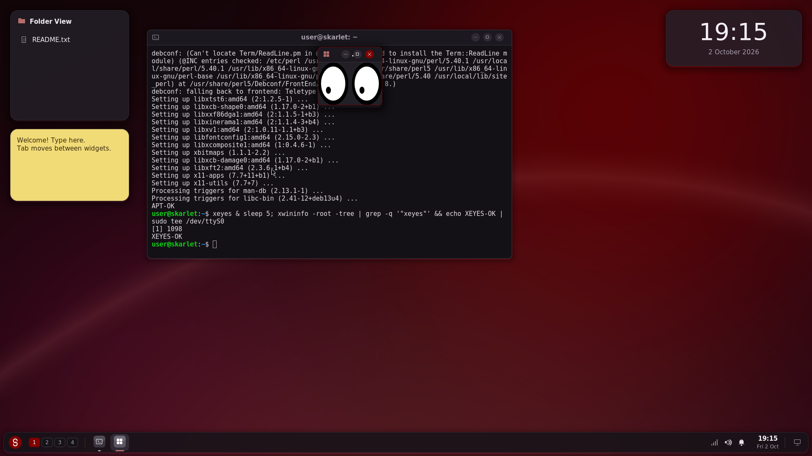
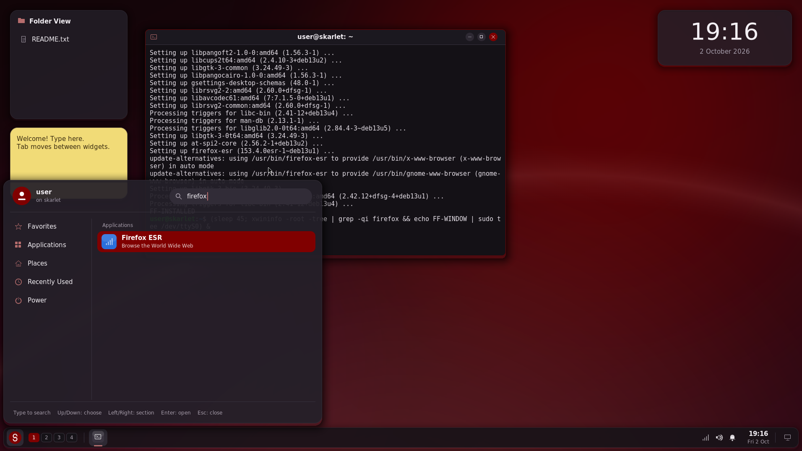
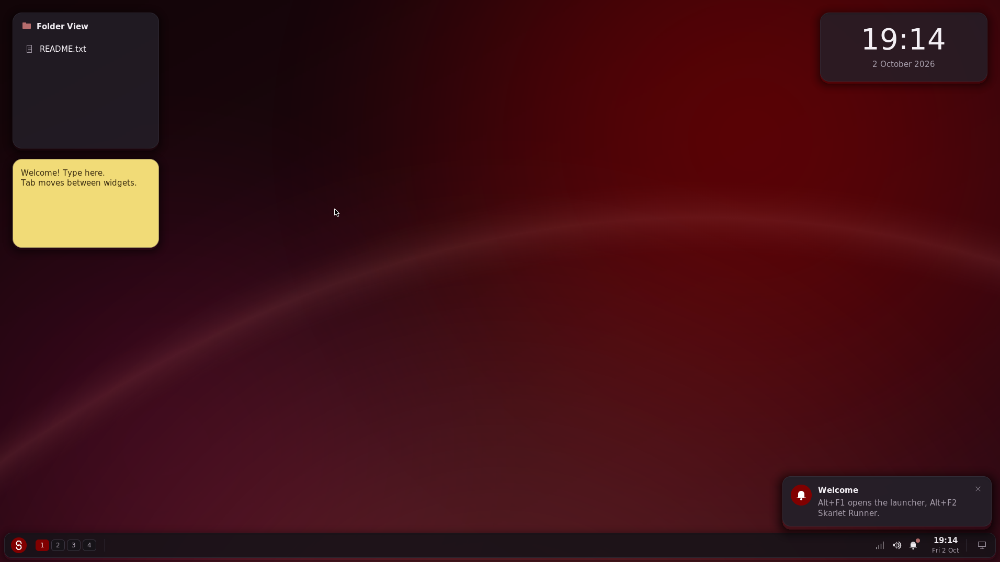

# SkarletOS

A small UNIX-like operating system for **x86-64 PCs**, written in C, with a
modern desktop inspired by **KDE Plasma**. It boots on its own with no Linux
underneath, draws everything itself in a **1918 × 1075** graphics mode, and its
accent colour is **maroon** by default.


| | | |
|---|---|---|
|  Skarlet Launcher (Alt+F1) |  Skarlet Files |  Add Widgets |
|  Login screen |  Skarlet Light theme |  Power tab |

These are real screenshots of `release/skarletos.iso` booted in QEMU with its
VMware SVGA adapter. The **[demo and examples guide](docs/EXAMPLES.md)** has the
full 21-screen tour (also as an [animated GIF](docs/screenshots/tour.gif)), shell
transcripts and two worked examples of extending the system.

It is a learning project: about 6,500 lines of C you can read in a few
afternoons. It is **not** a real UNIX: there are no processes, no memory
protection and no disk. See [What it does not do](#what-it-does-not-do).

**Want to install real Linux programs?** That is what the
**[Debian edition](#debian-edition-install-linux-software)** is for: the same
desktop running on Debian 13 with a Linux kernel and `apt`.

## Debian edition: install Linux software

The bare SkarletOS kernel above can only run the programs built into it.
Running ordinary Linux programs needs Linux's system calls, drivers and
libraries, far more than this kernel has, so the Debian edition does it the
other way round: it puts the **SkarletOS desktop on top of Debian 13
("trixie")**, a full Linux system. The desktop becomes the window manager:
the panel, launcher, runner, widgets, themes and the maroon accent are the
same code (`src/`), but now the windows can belong to any Linux program.


| | | |
|---|---|---|
|  The login checks your real password |  `apt-get install` in Skarlet Terminal |  A graphical program (xeyes) in a SkarletOS frame |
|  Installed programs appear in the launcher |  The desktop |  Booted from the disk after `skarlet-install` |

These are screenshots taken by the automatic test in QEMU (see below), at
1912 × 1075 because of QEMU's graphics card.

**Download:** `skarletos-linux.iso` (about 400 MB) from the
[SkarletOS Debian edition release](https://github.com/newmangarry323-sketch/Ai-Slop-that-Claude-Makes/releases/tag/skarletos-linux-v1.0).
It is too big to keep in the repository itself.

### Run it in VMware

1. *File → New Virtual Machine*, Typical, **Installer disc image file
   (iso)**: pick `skarletos-linux.iso`.
2. Guest operating system: **Linux**, **Debian 13.x 64-bit** (or "Other
   Linux 6.x kernel 64-bit" on older VMware).
3. **2 GB of memory or more**, and a **20 GB** disk if you want to install it.
4. BIOS or UEFI; with UEFI turn **Secure Boot off** (the boot loader on the
   ISO is not signed).
5. Power on and log in. The live system's password is **`skarlet`**.

### Installing and removing software

Open Skarlet Terminal (Alt+F1, Enter):

```sh
sudo apt update                # refresh the list of software (password: skarlet)
apt search image editor        # find programs
sudo apt install gimp          # install one (firefox-esr, vlc, libreoffice...)
sudo apt remove gimp           # uninstall it
man apt                        # apt's own manual
```

Any program Debian packages, terminal or graphical, installs this way, and
Debian packages tens of thousands of them [L1]. Debian's own package search
is at https://packages.debian.org/trixie/. A graphical program puts a
`.desktop` file in `/usr/share/applications` (the freedesktop.org Desktop
Entry rules [L3]); the launcher checks those folders every two seconds, so
the program appears there by itself, sorted into a category. Its windows get
SkarletOS frames, panel buttons, Alt+Tab, minimise, maximise and F11 full
screen.

Software that is not in Debian can work too if it is built for 64-bit
Linux: a `.deb` file from a program's website installs with
`sudo apt install ./file.deb`, and Flatpak is in Debian
(`sudo apt install flatpak`); the launcher also reads Flatpak's program
folder. These two paths are **not tested** here, only apt from Debian's
servers is.

### Keeping what you install

The live system runs from memory and forgets everything when it stops. To
keep your programs and files, install it to the virtual disk:

```sh
sudo skarlet-install
```

It asks which disk to use (**everything on it is erased**) and for a new
password, copies the running system (including what you installed),
and sets up booting for BIOS and UEFI. Shut down, remove the ISO from the
virtual CD drive, and start again.

### How the Debian edition fits together

```
linux/session.c      the X11 window manager: puts other programs' windows in
                     SkarletOS frames, shows the desktop through MIT-SHM, global
                     keys, focus, EWMH/ICCCM hints for full screen and closing
linux/term.c         Skarlet Terminal as a real terminal: a pty running bash,
                     decoded by libvterm (vendored in linux/libvterm, MIT)
linux/desktop_files.c  installed programs for the launcher (.desktop files)
linux/monitor.c      Skarlet Monitor and the System Monitor widget from /proc
linux/vfs_linux.c    Skarlet Files and Write on the real disk
linux/config.c       settings and widgets saved in ~/.config/skarletos/
linux/linux.c        start-up, starting programs, the PAM password check
debian/build-iso.sh  builds the ISO: mmdebstrap, squashfs, grub-mkrescue
debian/overlay/      files added to Debian: auto-start, skarlet-install, sudo rules
tools/linux_iso_test.py  the QEMU test described below
```

`make session` builds `build/skarlet-session` on any Linux with the X11 and
PAM development files. `sudo debian/build-iso.sh` builds the ISO on Debian 13
(it needs root, for the chroot); `.github/workflows/build-skarletos-linux.yml`
shows the exact steps CI uses.

### How the Debian edition was tested

Each push builds the ISO on GitHub's servers and runs `tools/linux_iso_test.py`,
which boots it in QEMU, types on the virtual keyboard and checks the screen
and the serial port:

* BIOS boot reaches the login screen; a wrong password is refused, `skarlet`
  logs in;
* in Skarlet Terminal, `sudo apt-get install x11-apps` downloads from
  Debian's servers and **xeyes** opens a window;
* `sudo apt-get install firefox-esr`, then Firefox is found in the launcher
  and **starts from it**;
* `skarlet-install` installs to an empty virtual disk, the machine **starts
  from that disk** and the new password works;
* the ISO also boots with **UEFI** to the login screen.

The desktop code itself was also checked on an X server without a screen
(Xvfb): window frames, focus, dragging, maximise, full screen, minimise and
restore, Alt+Tab, closing, the terminal and Skarlet Monitor.

**Not tested:** VMware itself, VirtualBox and real PCs. The screen size is
set by `skarlet-start`: 1918 × 1075 with VMware's graphics driver
(`vmwgfx`), 1912 × 1075 elsewhere, since QEMU's standard graphics card needs
a width divisible by 8. The VMware case is an expectation, not a tested
result.

### Limits

* Programs keep their own look (GTK, Qt...) inside SkarletOS's frames.
* SkarletOS's own Files and Write do not use the clipboard yet; other
  programs copy and paste as usual.
* Resizing the VMware window does not resize the desktop; choose the size
  in VMware or use full screen.
* There's no graphical app store; apt in the terminal is the way in.

## Run it in VMware

The bootable CD image is **`skarletos.iso`** (4 MiB): download it from the
[SkarletOS 0.1 release](https://github.com/newmangarry323-sketch/Ai-Slop-that-Claude-Makes/releases/tag/skarletos-v0.1) or take
[`release/skarletos.iso`](release/skarletos.iso) from this folder (the same
file). It boots with either BIOS or UEFI firmware.

1. Create a new virtual machine (Workstation: *File → New Virtual Machine*,
   Typical). Choose **"Installer disc image file (iso)"** and pick
   `skarletos.iso`.
2. Guest operating system: **Other**, version **Other 64-bit**. SkarletOS is a
   64-bit kernel and refuses to start on a 32-bit CPU.
3. Any disk size is fine. SkarletOS never touches the disk. Memory: 256 MB or more.
4. Optional: VMware lets you choose the firmware under *VM Settings → Options →
   Advanced* [V1]. Both **BIOS** and **UEFI** work, but if you pick UEFI, leave
   **Secure Boot off**. The boot loader on the ISO (Limine) is not signed with
   the keys Secure Boot checks.
5. Power on. The Limine menu shows for 2 seconds, then the SkarletOS login
   screen appears. Type any password and press **Enter**.

Click inside the VM window so it gets the keyboard. Everything is driven by keys
(see [Keys](#keys)); there is no mouse support yet. **Ctrl+Alt** releases the
keyboard back to your computer in VMware Workstation.

### Why 1918 × 1075?

That is the size you asked for, so SkarletOS draws its desktop at exactly 1918 ×
1075 pixels. How it gets there depends on the graphics card it finds:

| Graphics card | Where you find it | Screen |
|---|---|---|
| VMware SVGA II | VMware; VirtualBox "VMSVGA"; QEMU `-vga vmware` | Set to **exactly 1918 × 1075** by SkarletOS's own driver |
| Bochs/QEMU "DISPI" | QEMU `-vga std`, Bochs, VirtualBox "VBoxVGA" | **1912 × 1075**: this card needs a width that is a multiple of 8 |
| Anything else | Real PCs, other VMs | The boot loader picks a mode (it asks for 1920 × 1080). A larger screen gets the 1918 × 1075 desktop centred with a thin black border; a smaller one gets the desktop at its own size |

The desktop's layout adapts to whatever size it gets. VMware may scale the
picture to fit its window, so it can look slightly soft unless the window is
at least 1918 × 1075 or you use full screen.

## What you get

* **A 64-bit kernel.** The boot loader starts the CPU in 32-bit mode.
  `boot/boot.S` checks the CPU supports x86-64, builds page tables for the first
  4 GiB, switches to *long mode*, and calls C.
* **Graphics drivers** in `kernel/arch_x86_64.c`: a VMware SVGA II driver, a
  Bochs/QEMU DISPI driver, and the boot loader's framebuffer as a fallback.
  They're found by scanning the PCI bus.
* **A software renderer** (`src/gfx.c`): anti-aliased rounded rectangles,
  circles and lines, soft shadows, translucency, gradients, a generated wallpaper
  and vector icons. Text uses the DejaVu fonts, pre-rendered to anti-aliased
  bitmaps by `tools/mkfont.c`. All the maths is integer-only, because the kernel
  never turns on the floating-point unit.
* **A UNIX-style shell** inside a Skarlet Terminal window, with `ls -l`, `cd`, `cat`,
  `echo`, `> file` / `>> file` redirection, `mkdir`, `rm -r`, `cp`, `mv`, `wc`, `ps`,
  `kill`, `date`, `uname -a`, `history`, `calc` and more (`help` lists them all).
* **An in-memory file system** with a normal UNIX tree (`/bin`, `/etc`, `/home/user`,
  `/tmp`…), permission bits (shown, not enforced) and errno-style errors.
* **The Plasma desktop model:** widgets ("plasmoids") in containments, a panel,
  activities, a launcher, a runner, a desktop menu, themes and notifications.
* **Apps**, each a tiny re-imagining of a KDE application (not a port):

  | SkarletOS app | Shell command | Inspired by (KDE) |
  |---|---|---|
  | Skarlet Terminal | `skterm` | Konsole |
  | Skarlet Files | `skfiles [dir]` | Dolphin |
  | Skarlet Write | `skwrite [file]` | KWrite |
  | Skarlet Settings | `sksettings` | System Settings |
  | Skarlet Monitor | `skmonitor` | System Monitor |
  | Skarlet Launcher | Alt+F1 or Meta | Kickoff |
  | Skarlet Runner | Alt+F2 | KRunner |
* **Widgets:** Folder View, Notes, Digital Clock, System Monitor and the Fifteen
  Puzzle.
* **Themes:** Skarlet Dark (default) and Skarlet Light, each with an accent
  colour: **Maroon (default, #800000)**, Blue, Teal, Green or Purple. Three
  wallpapers: Glow, Dots and Plain.

## The modern look

Earlier versions imitated the 2012 Plasma 4 desktop in an 80 × 25 text mode.
This one takes its cues from current Plasma (Plasma 6 and its Breeze style)
and from other present-day desktops:

| Element | SkarletOS | Code |
|---|---|---|
| **Floating panel** | The panel is a rounded bar that floats a few pixels above the screen edge, as Plasma 6's panel does by default [K1]. It holds an accent-coloured launcher button, the pager, icon-only task buttons with an indicator under each running app, the system tray, the clock with the date, and show desktop | `draw_panel()` in `src/workspace.c` |
| **Window frames** | Rounded corners, soft shadows (deeper on the active window), the app icon on the left, a centred title, and round minimise/maximise/close buttons. The close button and a thin outline are in the accent colour on the active window | `draw_frame()` in `src/wm.c` |
| **Cards and popups** | The launcher, runner, menus, widgets and notifications are rounded, slightly translucent cards with shadows | `card()` in `src/workspace.c` |
| **Launcher** | A sidebar of sections (Favorites, Applications, Places, Recently Used, Power), a search field in the header, two-line entries with coloured app icons | `draw_launcher()` |
| **Lock/login screen** | A large clock and date over a darkened wallpaper, an avatar and a password field | `draw_login()` |
| **Dark by default** | Skarlet Dark, with Skarlet Light one setting away | `theme_apply()` in `src/gfx.c` |

The look is my own design in this spirit. It is not copied from KDE's artwork,
and I have not compared it to Plasma 6 pixel by pixel.

## Building it yourself

You need Linux with `gcc`, GNU `ld`, `make`, `git` and `python3`.

```sh
cd skarletos
make            # build/skarletos.bin, the kernel
make iso        # build/skarletos.iso (downloads the Limine boot loader once)
make run        # boot the ISO in QEMU with the VMware SVGA adapter
make test       # 192 scripted checks of the desktop code, plus 40,000 random keys
make qemutest   # boot the ISO in QEMU, press keys, check the screen
make demo       # the 21-step screenshot tour in build/tour (QEMU, ImageMagick, ffmpeg)
make shell      # build/skarlet-sh: the shell and file system on your Linux command line
```

`make run OVMF=/path/to/OVMF_CODE.fd` boots with UEFI firmware instead of the
BIOS. `make run-kernel` skips the ISO and uses QEMU's `-kernel` option.

How the ISO is put together:

* `skarletos.bin` is a **Multiboot 1** kernel [S1]. It uses the "address fields"
  (flag bit 16), so a 32-bit boot loader can load it even though the code
  inside is 64-bit. It also asks for a graphics mode (flag bit 2).
* **Limine** [S2] is the boot loader. Its `limine-bios-cd.bin` starts the BIOS
  boot and `limine-uefi-cd.bin` (a small FAT disk image) the UEFI boot.
  `boot/limine.conf` tells it to load `/boot/skarletos.bin` with the
  `multiboot1` protocol.
* `tools/mkiso.py` writes the CD image itself (ISO 9660 [S3] with an El Torito
  [S4] boot catalog holding one BIOS and one UEFI entry), so `xorriso` isn't
  needed. It also writes a partition table entry for the UEFI image and pads
  the disc to a whole MiB. Both turned out to be necessary; the comments in the
  script say why.

### Keys

| Key | Action |
|---|---|
| Alt+F1, or tap Meta (the Windows key) | Skarlet Launcher |
| Alt+F2 | Skarlet Runner: apps, places like `/etc`, maths like `6*7`, commands |
| Alt+F12 | Desktop menu: Add Widgets, Activities, Lock Widgets, Desktop Settings |
| Alt+Tab / Alt+F4 | Next window / close window |
| Alt+F7, then arrows, Enter | Move the active window |
| Ctrl+F1 … Ctrl+F4 | Switch virtual desktop |
| Ctrl+F12 | Show the desktop widgets over the windows |
| Ctrl+Esc | Skarlet Monitor |
| Tab / Shift+Tab | On the desktop: focus the next/previous widget |
| Alt+arrows | Move the focused widget (when widgets are unlocked) |
| Delete | Remove the focused widget (when unlocked) |
| Shift+PgUp / PgDn | Skarlet Terminal scrollback |
| Ctrl+S | Save in Skarlet Write |

Alt+F2 opens KRunner in KDE too [K2]. The other bindings are my choices for a
keyboard-only desktop and are not meant as exact KDE defaults.

## How it fits together

```
boot/boot.S          32-bit entry -> page tables (4 GiB) -> long mode -> kmain()
boot/linker.ld       memory layout (kernel at 1 MiB)
boot/limine.conf     boot loader menu for the ISO
kernel/arch_x86_64.c the only hardware code: PCI scan, VMware SVGA II / DISPI /
                     boot framebuffer, page-table caching modes, PS/2 keyboard,
                     CMOS clock, serial log (COM1), reboot and power-off
src/platform.h       the small hardware boundary (keys, screen, time, power)
src/gfx.c            back buffer, shapes, text, icons, themes, wallpaper
src/font_data.c      DejaVu glyphs, generated by tools/mkfont.c
src/workspace.c      main loop, key routing, panel, launcher, runner, menus,
                     activities, notifications, login screen
src/wm.c             window manager: stacking, focus, frames, virtual desktops
src/apps.c           Skarlet Terminal, Files, Write, Settings and Monitor
src/plasmoids.c      desktop widgets
src/shell.c          command parsing, redirection, built-in commands
src/vfs.c            the in-memory file system and the starting files
src/lib.c            string functions, printf, calculator (no libc in a kernel)
host/                Linux implementations of platform.h: UI tests, shell
tools/               mkiso.py, mkfont.c, QEMU test and screenshot tour
release/             the prebuilt ISO
```

Because only `kernel/arch_x86_64.c` touches hardware, the rest compiles unchanged
on Linux. That is how `make test` runs the real desktop code.

Each frame is drawn into a back buffer in RAM. `plat_present()` then copies
only the rows that changed to the graphics card, because card memory is much
slower to write than RAM. The framebuffer is mapped *write-combining* through
the CPU's PAT register, which lets the CPU send those writes in bursts. On the
VMware card, an UPDATE command tells the card which rows changed [S5].

## How it was tested

* `make test`: the desktop code on Linux under AddressSanitizer and UBSan, at
  1918 × 1075. It makes 192 checks: shell, file system, launcher, runner,
  windows, widgets, strips, themes, the maroon accent and shutdown. Then it
  sends 40,000 random key presses. All pass.
* **The ISO in QEMU 9.2.0** (built from source), with real PS/2 key presses sent
  through QEMU's monitor:

  | Firmware | Graphics | Result |
  |---|---|---|
  | BIOS (SeaBIOS) | `-vga vmware` (VMware SVGA II) | 1918 × 1075, all checks pass |
  | UEFI (edk2/OVMF) | `-vga vmware` | 1918 × 1075, all checks pass |
  | BIOS | `-vga std` (DISPI) | 1912 × 1075, all checks pass |
  | UEFI | `bochs-display` (boot loader framebuffer) | 1920 × 1080 with the desktop centred, all checks pass |

  `make demo` runs the 21-step tour. Before saving each screenshot it reads the
  kernel's record of the text it drew, straight out of guest memory, and checks
  that the expected text is there. At the end it checks that the guest powered
  itself off.
* **Not tested: VMware itself.** It couldn't be run where this was built.
  QEMU's `vmware-svga` device implements the same SVGA II registers and
  commands, and my driver uses only registers documented in VMware's own
  `svga_reg.h` [S5], so I expect it to work. Treat that as an expectation, not a
  result. If you try it, the serial log helps: add a serial port that writes to
  a file (*VM Settings → Add → Serial Port → Use output file*). SkarletOS writes
  which screen driver it chose there.
* VirtualBox is not tested either, although its VMSVGA and VBoxVGA adapters
  use the same two interfaces.
* Not tested on real PCs. There, the PS/2 keyboard may need the firmware's USB
  legacy emulation, and power-off needs a full ACPI driver that SkarletOS
  doesn't have, so "Shut down" stops at the shut-down screen.

## What it does not do

No processes or scheduler, no user/kernel separation, no interrupts (the keyboard
and clock are *polled*, which keeps one CPU core busy), no disk (files vanish on
reboot), no mouse, no networking, no sound. Passwords are not checked. Each of
these is a good next project.

## Learning from it, and exercises

Read the files in this order: `boot/boot.S`, `kernel/arch_x86_64.c`, `src/gfx.c`,
`src/vfs.c`, `src/shell.c`, `src/plasmoids.c`, `src/workspace.c`. Then try,
roughly from easiest to hardest:

1. Add a shell command (say `rev` or `head`) in `src/shell.c`. [EXAMPLES.md](docs/EXAMPLES.md) walks through one.
2. Write a new widget (a calendar?) in `src/plasmoids.c`. EXAMPLES.md walks through a Counter.
3. Add an accent colour to `g_accents[]`, or a new wallpaper style to `render_wallpaper()`, in `src/gfx.c`.
4. Draw a new icon in `gfx_icon()`. Icons are lines and circles on a 24-unit grid.
5. Support pipes (`ls | wc`) in the shell.
6. Read the mouse from the PS/2 controller and draw a pointer (it would need
   redrawing without repainting the whole screen).
7. Replace polling with interrupts: build an IDT, remap the PIC, and use `hlt` to idle.

Try each step yourself before looking anything up. The sources below explain
the hardware side, and reading them is how you'll learn to do the next step
without help.

## Logo

`docs/logo/` has the logo as SVG (scales to any size) and as PNGs with
transparent backgrounds (64, 128, 256 and 512 px): `skarletos-logo` is the white
S on the maroon (#800000) circle, `skarletos-mark` is the maroon S alone. It is
the same shape the OS draws on the panel's launcher button and the shut-down
screen (`IC_LOGO` in `src/gfx.c`).

## Licences

SkarletOS's own code is under this repository's licence. The ISO also contains
the **Limine** boot loader (BSD 2-Clause; its licence is in
`release/LIMINE-LICENSE.txt` and on the disc as `boot/limine/license.txt`). The
glyphs in `src/font_data.c` are rendered from the **DejaVu** fonts (Bitstream
Vera licence, with DejaVu's changes in the public domain; see
`docs/FONT-LICENSE.txt`).

The Debian edition's ISO is mostly Debian: each package keeps its own
licence, listed in `/usr/share/doc/PACKAGE/copyright` on the system. It boots
with GRUB (GPL-3.0-or-later). Skarlet Terminal uses libvterm (MIT,
`linux/libvterm/LICENSE`).

## Sources

None of these are state-run media. Where I relied on reading source code
rather than documentation, I say so.

* [K1] KDE, "KDE MegaRelease 6" (Plasma 6, released 28 February 2024; the panel
  floats by default): https://kde.org/announcements/megarelease/6/
* [K2] KDE UserBase, "Plasma/Krunner" (KRunner opens with Alt+F2):
  https://userbase.kde.org/Plasma/Krunner
* [V1] Broadcom (VMware) TechDocs, "Configuring the Firmware Type for a Virtual
  Machine" (Workstation Pro 17):
  https://techdocs.broadcom.com/us/en/vmware-cis/desktop-hypervisors/workstation-pro/17-0/using-vmware-workstation-pro/configuring-virtual-machine-option-settings/configuring-advanced-options-for-a-virtual-machine/configuring-the-firmware-type-for-a-virtual-machine.html
* [S1] GNU, "Multiboot Specification version 0.6.96":
  https://www.gnu.org/software/grub/manual/multiboot/multiboot.html. Note: the
  framebuffer colour fields are at byte 112 in practice. The spec's table says
  110, but Limine's `common/protos/multiboot1.h` puts them at 112 (I checked
  that in Limine's source), and so, as far as I know, does GRUB's `multiboot.h`.
* [S2] Limine boot loader, v11.4.1: https://github.com/limine-bootloader/limine
  (`USAGE.md`, `CONFIG.md`, and the source of its ISO 9660 and Multiboot 1 code)
* [S3] Ecma International, ECMA-119 "Volume and File Structure of CDROM for
  Information Interchange" (ISO 9660):
  https://ecma-international.org/publications-and-standards/standards/ecma-119/
* [S4] Phoenix Technologies and IBM, "El Torito Bootable CD-ROM Format
  Specification 1.0" (1995)
* [S5] VMware, `svga_reg.h` (SVGA II registers, the FIFO and the UPDATE command),
  as shipped in the Linux kernel:
  https://github.com/torvalds/linux/blob/master/drivers/gpu/drm/vmwgfx/device_include/svga_reg.h.
  The PCI ID 15AD:0405 comes from QEMU's `include/hw/pci/pci.h` and its
  `hw/display/vmware_vga.c`, which also served as a second reference.
* OSDev Wiki, "Bochs VBE Extensions" (the DISPI registers):
  https://wiki.osdev.org/Bochs_VBE_Extensions
* OSDev Wiki, "PCI" (configuration ports 0xCF8/0xCFC):
  https://wiki.osdev.org/PCI
* OSDev Wiki, "8042 PS/2 Controller" and "PS/2 Keyboard":
  https://wiki.osdev.org/%228042%22_PS/2_Controller,
  https://wiki.osdev.org/PS/2_Keyboard
* OSDev Wiki, "CMOS" and "RTC": https://wiki.osdev.org/CMOS, https://wiki.osdev.org/RTC
* OSDev Wiki, "Shutdown" and "Reboot": https://wiki.osdev.org/Shutdown,
  https://wiki.osdev.org/Reboot
* OSDev Wiki, "Setting Up Long Mode": https://wiki.osdev.org/Setting_Up_Long_Mode
* Intel, "Intel 64 and IA-32 Architectures Software Developer's Manual",
  Volume 3, chapter "Memory Cache Control" (the PAT and write-combining):
  https://www.intel.com/content/www/us/en/developer/articles/technical/intel-sdm.html
* DejaVu fonts: https://dejavu-fonts.github.io/
* [L1] Debian, "Debian 13 trixie" release information:
  https://www.debian.org/releases/trixie/ and the Debian Reference / `man apt`
* [L2] Debian Wiki, "DebianLive" (live-boot): https://wiki.debian.org/DebianLive;
  mmdebstrap: https://gitlab.mister-muffin.de/josch/mmdebstrap
* [L3] freedesktop.org, "Desktop Entry Specification":
  https://specifications.freedesktop.org/desktop-entry-spec/latest/
* [L4] freedesktop.org, "Extended Window Manager Hints":
  https://specifications.freedesktop.org/wm-spec/latest/ and X.Org, "Inter-Client
  Communication Conventions Manual":
  https://x.org/releases/X11R7.6/doc/xorg-docs/specs/ICCCM/icccm.html
* [L5] libvterm: https://github.com/neovim/libvterm (MIT licence)
* [L6] Linux-PAM: https://github.com/linux-pam/linux-pam and `man pam`
* W3C, "CSS Color Module Level 3" (maroon = #800000):
  https://www.w3.org/TR/css-color-3/#html4

The OSDev, Intel, ECMA, El Torito and W3C references are cited from general
knowledge. kde.org, osdev.org and most other sites weren't reachable from where
this was built, so I couldn't re-open them. The VMware header, Limine and QEMU
were read as source code. The KDE Plasma 6 facts come from search results
pointing at KDE's own announcement.
