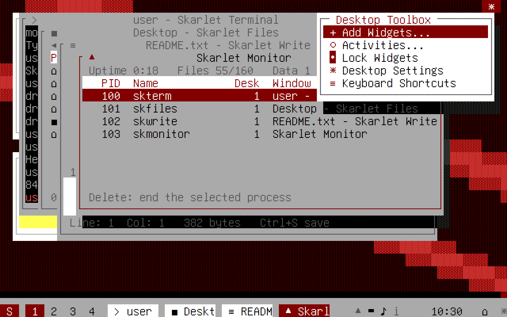
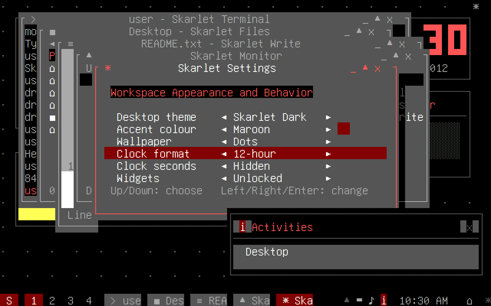
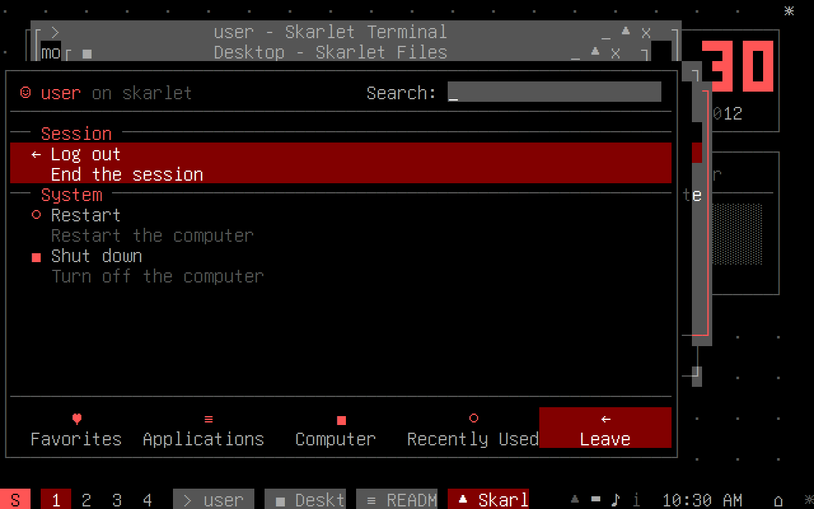

# SkarletOS demo and examples

Everything on this page was produced by running SkarletOS, not drawn or typed by
hand:

* The **screenshots** come from the real kernel (`build/skarletos.bin`) booted in
  the Unicorn x86-64 emulator. `tools/demo_tour.py` presses keys on the emulated
  PS/2 keyboard and saves the VGA text memory after each step, and
  `tools/vga_render.py` draws it with the VGA palette (colour 4 as maroon, as the
  kernel programs it) and the Unifont 8×16 font. Every step checks that the
  expected text is on screen before saving. Re-create them with `make demo`.
* The **shell transcripts** are output of `build/skarlet-sh` (`make shell`), which
  runs the same shell and file-system code as the kernel.
* The **code examples** were applied to a copy of the source tree. That copy was
  built (kernel and tests) and checked before they were written here.

The emulated clock starts at 10:30:00 on 1 August 2012, the day KDE released
Plasma Workspaces 4.9, and ticks one second per step. The interface imitates the
Plasma 4.8 desktop that came just before it.


## Screenshot tour

Each caption says which keys led to the screen.

### 1. Logging in

The login screen after typing a password (any password works; it is not checked).

### 2. The desktop

**Enter** logs in. The desktop containment holds three plasmoids: Folder View (the
files in `~/Desktop`, with its title inside the widget), the Digital Clock and a
Notes sticky note. The welcome notification sits above the system tray. The panel
along the bottom, left to right: the launcher `S`, the pager `1 2 3 4`, the task
manager (empty), the system tray (hidden-icons arrow, device notifier, volume,
notifications), the clock, show desktop `⌂` and the panel toolbox `☼`. The thin
dark band above the panel is its rim. The desktop toolbox ("cashew") is the `☼` in
the top right corner.

### 3. Skarlet Launcher (after Kickoff)

**Alt+F1** opens the launcher: the user and the search field in the header, the
favourites as two-line entries (name, then description), and the five tabs with
their icons along the bottom.


**Right arrow** switches to Applications, which lists categories. **Enter** on
System opens it, with a "◄ All Applications ► System" breadcrumb. **Backspace**
goes back.

### 4. Skarlet Runner as a calculator

**Alt+F2** drops the runner down from the top edge: help `?` and settings `☼` on
the left, close `x` on the right. Typing `(12+30)*2` gives `= 84` from the
calculator runner, and the command-line runner offers to run the text.

### 5. Skarlet Terminal and the shell

**Alt+F1, Enter** starts Skarlet Terminal (the first favourite). Commands typed:
`uname -a`, `ls -l`, `echo Hello from SkarletOS > hello.txt`, `cat hello.txt`,
`calc (12+30)*2`. The window decoration follows KDE 4's Oxygen style: a
window-coloured title bar with the app's icon on the left and `_ ▲ x` on the
right, and a maroon glow round the active window.

### 6. Skarlet Runner opening a place

**Alt+F2** and `/home/user/Desktop`: the places runner offers to open it in
Skarlet Files.

### 7. Skarlet Files

**Enter** opens Skarlet Files there: Places panel on the left, files on the
right, location bar on top, folder/file count at the bottom.

### 8. Skarlet Write

**Enter** on `README.txt` opens it in Skarlet Write, with line numbers and a
status bar. **Ctrl+S** saves.

### 9. Skarlet Monitor

**Ctrl+Esc** lists the running "processes" (one per window) with PID, name,
virtual desktop and title. **Delete** ends the selected one. The panel's task
manager now has a button, with an icon, for each window.

### 10. Dashboard

**Ctrl+F12** hides the windows to show the desktop widgets; the show-desktop
icon on the panel lights up. Press it again to bring the windows back.

### 11. The desktop toolbox and Add Widgets

**Alt+F12** opens the desktop toolbox: Add Widgets, Activities, Lock Widgets,
Desktop Settings and Keyboard Shortcuts.


**Enter** opens Add Widgets as a strip above the panel: a tile per widget, the
selected widget's description, and a search field (type to narrow the tiles).


**Right ×3, Enter** adds a System Monitor to the first free spot and shows a
notification; **Ctrl+F12** shows it. Because it is focused and widgets are
unlocked, its applet handle (`x` to remove, `↕` to move) is beside it.

### 12. Activities

Toolbox → **Activities...** opens the same kind of strip: one tile per activity
(the current one marked), plus New Activity. **Delete** removes the selected
activity.


Switching to **Play** shows a different set of widgets: a System Monitor and the
Fifteen Puzzle, focused with **Tab** and played with the arrow keys. The windows
stay behind in the "Desktop" activity they belong to.

### 13. Skarlet Settings and the dark theme

Back in "Desktop", **Alt+F2** `settings` **Enter** opens Skarlet Settings.
Changes made: theme Skarlet Light → Skarlet Dark, wallpaper → Dots, clock →
12-hour (the panel now reads `10:30 AM`). The accent stays **Maroon**, shown by
the swatch; Left/Right on "Accent colour" would choose Blue, Teal, Green or
Purple.


**Alt+F4** closes Skarlet Settings. The windows, panel and launcher now use the
dark colours, still with maroon highlights.

### 14. Recently Used and Leave

**Alt+F1, Right ×3** shows Recently Used, split like Kickoff's into Applications
(Skarlet Settings and Skarlet Terminal, started from the runner and the
launcher) and Documents (the `README.txt` opened in Skarlet Write).


**Right** moves to Leave, grouped into Session (Log out) and System (Restart,
Shut down).


**Shut down** draws this screen, then writes to the QEMU power-off port (the demo
checks that the write happened).

## Shell examples

Try them with `make shell && ./build/skarlet-sh`, or in Skarlet Terminal inside
SkarletOS.

### Looking around the file system
```
user@skarlet:~$ pwd
/home/user
user@skarlet:~$ ls
Desktop/  Documents/  Music/
user@skarlet:~$ ls -a
Desktop/  Documents/  Music/  .profile
user@skarlet:~$ ls -l /
drwxr-xr-x root root     0 bin/
drwxr-xr-x root root     0 etc/
drwxr-xr-x root root     0 home/
drwx------ root root     0 root/
drwxrwxrwt root root     0 tmp/
drwxr-xr-x root root     0 usr/
user@skarlet:~$ cat /etc/os-release
NAME="SkarletOS"
VERSION="0.1"
ID=skarletos
PRETTY_NAME="SkarletOS 0.1 (x86-64)"
user@skarlet:~$ cd Documents
user@skarlet:~/Documents$ cat plasma-notes.txt
Plasma 4 ideas this desktop copies:
* everything on the desktop and panel is a widget (plasmoid)
* widgets live in containments (the desktop, the panel)
* activities: separate sets of widgets for separate tasks
* KRunner (Skarlet Runner here): one box that launches, calculates, runs
```
Note the UNIX details: `ls` hides "dot files" unless you add `-a`, and `ls -l`
shows permission bits. On a real UNIX system `drwx------` would make `/root`
private, and the sticky bit (`t`) on `/tmp` would stop users deleting each
other's files. **SkarletOS only displays these bits; it does not enforce them.**
There is a single user and no permission checks, which would be a good exercise
to add.

### Making, changing and removing files
```
user@skarlet:~$ mkdir projects
user@skarlet:~$ cd projects
user@skarlet:~/projects$ echo "first line" > notes.txt
user@skarlet:~/projects$ echo "second line" >> notes.txt
user@skarlet:~/projects$ cat notes.txt
first line
second line
user@skarlet:~/projects$ wc notes.txt
   2    4    23 notes.txt
user@skarlet:~/projects$ cp notes.txt backup.txt
user@skarlet:~/projects$ mv backup.txt old.txt
user@skarlet:~/projects$ ls -l
-rw-r--r-- user user    23 notes.txt
-rw-r--r-- user user    23 old.txt
user@skarlet:~/projects$ rm old.txt
user@skarlet:~/projects$ ls
notes.txt
user@skarlet:~/projects$ cd ..
user@skarlet:~$ rm -r projects
user@skarlet:~$ ls
Desktop/  Documents/  Music/
```
`>` replaces a file's contents and `>>` appends. `wc` prints lines, words and
bytes: 23 bytes is the 21 visible characters plus the two newlines.

### Errors, UNIX style
```
user@skarlet:~$ cat missing.txt
cat: missing.txt: No such file or directory
user@skarlet:~$ cd /etc/passwd
cd: /etc/passwd: Not a directory
user@skarlet:~$ rm /bin
rm: /bin: Is a directory
user@skarlet:~$ rmdir /home
rmdir: /home: Directory not empty
user@skarlet:~$ mkdir /tmp
mkdir: /tmp: File exists
user@skarlet:~$ echo hi >
sh: syntax error near '>'
user@skarlet:~$ frobnicate
sh: frobnicate: command not found
```
These are the usual C library messages for the error codes ENOENT, ENOTDIR,
EISDIR, ENOTEMPTY and EEXIST. `src/vfs.h` uses Linux's numbers for them; other
UNIX systems number some codes differently (ENOTEMPTY, for example).

### Maths and system information
```
user@skarlet:~$ calc 2+3*4
14
user@skarlet:~$ calc (2+3)*4
20
user@skarlet:~$ calc 17 % 5
2
user@skarlet:~$ calc 7/0
calc: invalid expression
user@skarlet:~$ uname -a
SkarletOS skarlet 0.1 #1 x86_64 SkarletOS
user@skarlet:~$ whoami
user
user@skarlet:~$ hostname
skarlet
user@skarlet:~$ ls /bin
calc  cat  cd  clear  cp  date  echo  exit  free  help  history  hostname  kill  ls  mkdir  mv  poweroff  ps  pwd  reboot  rm  rmdir  skdialog  skfiles  skmonitor  sksettings  skterm  skwrite  touch  uname  uptime  wc  whoami
```
`calc` uses whole numbers only (`7/2` is `3`). It refuses division by zero and
results outside the 32-bit range. Every built-in command also has a file in
`/bin`, including the `sk...` commands that start the apps.

### Windows as processes
```
user@skarlet:~$ skterm
user@skarlet:~$ skfiles /etc
user@skarlet:~$ skwrite ~/Desktop/todo.txt
user@skarlet:~$ ps
  PID CMD        DESK  TITLE
    1 skdesktop     -  SkarletOS Desktop Shell
  100 skterm        1  user - Skarlet Terminal
  101 skfiles       1  etc - Skarlet Files
  102 skwrite       1  todo.txt - Skarlet Write
user@skarlet:~$ kill 101
user@skarlet:~$ ps
  PID CMD        DESK  TITLE
    1 skdesktop     -  SkarletOS Desktop Shell
  100 skterm        1  user - Skarlet Terminal
  102 skwrite       1  todo.txt - Skarlet Write
user@skarlet:~$ skdialog --msgbox "Build finished"
user@skarlet:~$ history
   1  skterm
   2  skfiles /etc
   3  skwrite ~/Desktop/todo.txt
   4  ps
   5  kill 101
   6  ps
   7  skdialog --msgbox "Build finished"
   8  history
```
SkarletOS has no real processes. Each window gets a process ID so that `ps` and
`kill` behave the UNIX way. In the desktop, `skdialog --msgbox` shows a
notification (it is modelled on KDE's `kdialog`).

## Skarlet Runner examples

Open the runner with **Alt+F2**, type, then pick a result with the arrow keys and
**Enter**.

| You type | You get |
|---|---|
| `6*7` or `=6*7` | `= 42` (calculator runner). Enter puts 42 back in the box |
| `skfiles`, `file`, `term` | Matching apps by command, name or generic name ("File Manager", "Terminal") |
| `/etc`, `~/Documents` | "Open /etc" in Skarlet Files. A file path opens in Skarlet Write |
| `echo hi > /tmp/x` | "Run …": opens Skarlet Terminal and runs it there |

## Code examples: extending SkarletOS

### A new shell command: `rev`
Add this to `src/shell.c`, above `struct command`:

```c
static int cmd_rev(struct ctx *c)
{
    for (int i = 1; i < c->argc; i++) {
        int n = k_strlen(c->argv[i]);
        char buf[SH_LINE];
        for (int j = 0; j < n; j++)
            buf[j] = c->argv[i][n - 1 - j];
        buf[n] = 0;
        out(c, buf);
        out(c, i + 1 < c->argc ? " " : "");
    }
    out(c, "\n");
    return 0;
}
```

Then register it in two places in the same file: `{ "rev", cmd_rev },` in the
`commands[]` table (which runs it), and `"rev",` in `g_shell_commands[]` (which
makes `help` list it and puts `/bin/rev` in the file system). Result:

```
user@skarlet:~$ rev hello world
olleh dlrow
user@skarlet:~$ rev abc > x.txt
user@skarlet:~$ cat x.txt
cba
```

Because the command uses `out()`, redirection works without extra code.

### A new widget: Counter
Add this to `src/plasmoids.c`, above `g_plasmoid_types`:

```c
static void counter_draw(struct plasmoid *p, int x, int y, int w, int h, int focused)
{
    char buf[16];
    k_snprintf(buf, sizeof buf, "%d", p->sel); /* p->sel is free to use here */
    gfx_center(x, y + h / 2, w, buf, g_theme->widget_head);
    if (focused)
        gfx_center(x, y + h - 1, w, "+ / - to count", g_theme->widget);
}

static int counter_key(struct plasmoid *p, struct key k)
{
    if (k.code == '+' || k.code == '=')
        p->sel++;
    else if (k.code == '-')
        p->sel--;
    else
        return 0; /* not ours: let the desktop handle it */
    return 1;
}
```

Add a row to the `g_plasmoid_types` table. `.header = 1` puts the title inside
the widget, and `.icon` is the glyph on its Add Widgets tile:

```c
    [PL_COUNTER] = { .id = "counter", .name = "Counter", .desc = "Press + and - to count",
                     .icon = '+', .header = 1, .w = 18, .h = 7, .draw = counter_draw,
                     .key = counter_key },
```

and a name to the enum in `src/desktop.h`, just before `PL_COUNT`:

```c
enum { PL_FOLDERVIEW, PL_NOTES, PL_CLOCK, PL_SYSMON, PL_FIFTEEN, PL_COUNTER, PL_COUNT };
```

Counter now appears as a sixth tile in **Alt+F12 → Add Widgets...** (the strip
scrolls to show it). In the check run, adding it and pressing `+ + + -` showed
`2`, with the applet handle beside the widget.

This is the Plasma idea in miniature. The desktop containment never needs to
know what a Counter is: it only calls `draw` and `key` through the table.

### Things to try next
* `head FILE` (first 5 lines) or `grep WORD FILE` as shell commands.
* A **Calendar** widget using the date in `g_ws.now`.
* A new accent colour: add a line to `g_accents[]` in `src/gfx.c`.
